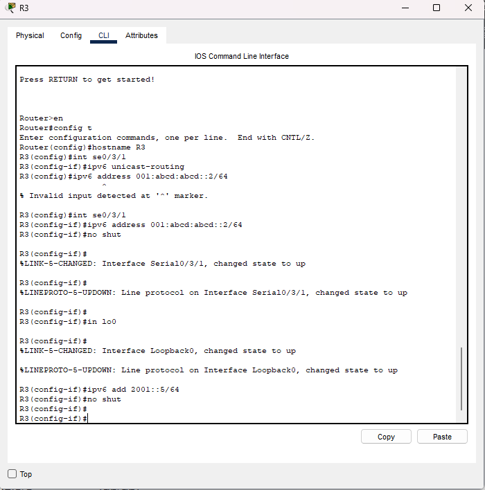
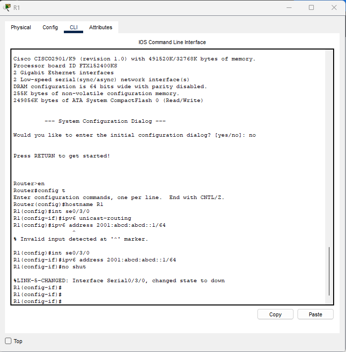

🧭 Overview

This lab covers foundational IPv4 interface configuration, verification, and troubleshooting using Cisco 2901 routers with HWIC-2T modules. Interfaces used:

R1: Serial0/3/0 (DCE)

R3: Serial0/3/1 (DTE)

Direct point-to-point serial connection

🖥️ Network Topology

Two Cisco 2901 routers

Serial DCE/DTE connection

HDLC encapsulation


 🎯 Lab Objectives

Configure Hostnames for R1 and R3

Configure IPv4 Addresses on Serial Interfaces

Configure Loopbacks on R3

Verify & Troubleshoot interface states and connectivity

🔧 Configuration Steps
Step 1 — Configure Hostnames

R1


```bash
conf t
hostname R1
end
```
R3


```bash
conf t
hostname R3
end
```
Step 2 — Configure Serial Interfaces
R1 — Serial0/3/0 (DCE)

(Clock rate required on DCE side)


```bash
conf t
interface Se0/3/0
 clock rate 800000
 no shutdown
end
```

R3 — Serial0/3/1 (DTE)

```bash
R3(config)#ipv6 unicast-routing
R3(config)#interface Se0/3/1
R3(config-if)#ipv6 add 2001:abcd:abcd::2/64
R3(config-if)#no shut
R3(config)#interface lo0
R3(config-if)#ipv6 add 2001::5/64
```
R1 - Serial0/3/0 (DCE)

```bash
R1(config)#ipv6 unicast-routing
R1(config)#interface Se0/3/0 
R1(config-if)#ipv6 add 2001:abcd:abcd::1/64
R1(config-if)#no shut
```

🔍 Step 4 — Verification Commands
Check All Interface Status + IPs

```bash
R3#show ipv6 int brief
show ipv6 interface se0/3/1
```


 
