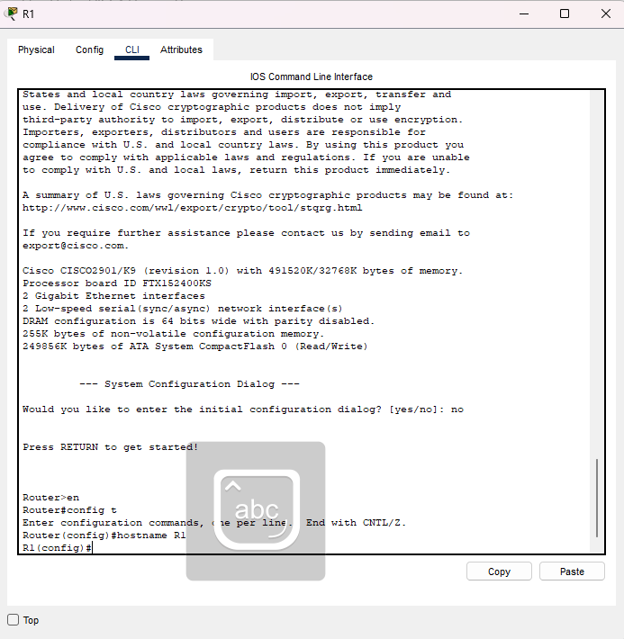
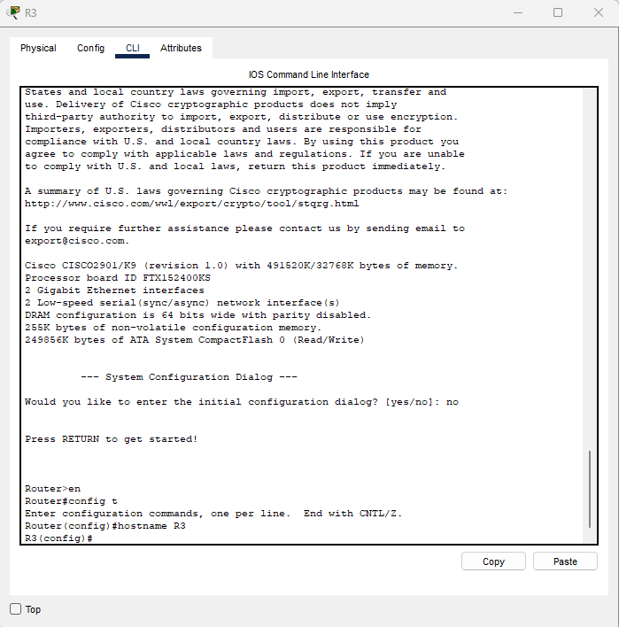
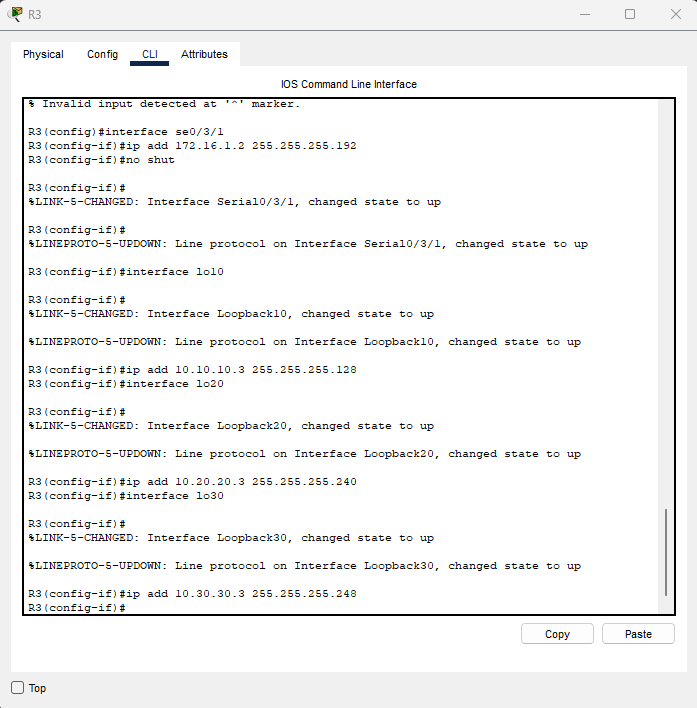
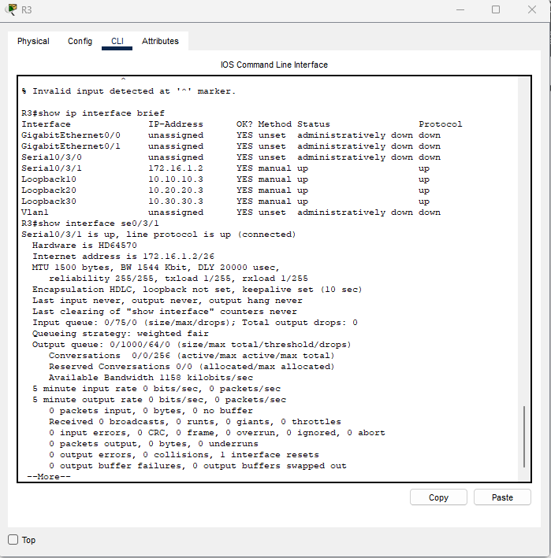
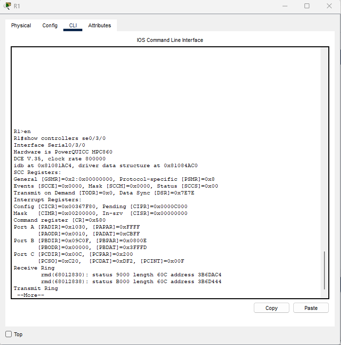
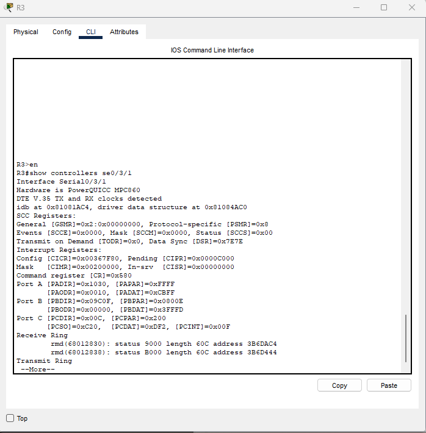

📝 Overview

This lab covers foundational IPv4 interface configuration and verification on Cisco routers using Packet Tracer.
Routers used: Cisco 2901 with HWIC-2T serial modules, using interfaces Serial0/3/0 and Serial0/3/1.

🖥️ Network Topology
Architecture:
Two Cisco 2901 routers connected directly via serial link
R1 → Serial0/3/0
R3 → Serial0/3/1
Point-to-point connection
DCE/DTE configuration required

🎯 Lab Objectives
Configure Hostnames
Configure IPv4 Addresses on serial interfaces
Configure Loopback Interfaces
Verify and Troubleshoot connectivity

🧩 Configuration Steps

Step 1 — Configure Hostnames
R1

```bash 
conf t
hostname R1
end
```
R3

```bash
conf t
hostname R3
end
```
Step 2 — Configure Serial Interfaces
R1 – Serial0/3/0 (DCE side)

```bash
conf t
interface se0/3/0
ip address 172.16.1.1 255.255.255.192
clock rate 800000
no shutdown
end
```
R3 – Serial0/3/1 (DTE side)

```bash
R3(config)#interface se0/3/1
R3(config-if)#ip add 172.16.1.2 255.255.255.192
R3(config-if)#no shut
R3(config)#interface lo10
R3(config-if)#ip add 10.10.10.3 255.255.255.128
R3(config)#interface lo20
R3(config-if)#ip add 10.20.20.3 255.255.255.240
R3(config)#interface lo30
R3(config-if)#ip add 10.30.30.3 255.255.255.248
```

🔍 Step 4 — Verification Commands
Verify interface addresses

```bash
R3#show ip interface brief
R3#show interface se0/3/1
```

R1 - Check DCE

```bash
show controllers se0/3/0
```

R3 - Check DTE 

```bash
show controllers se0/3/1
```


