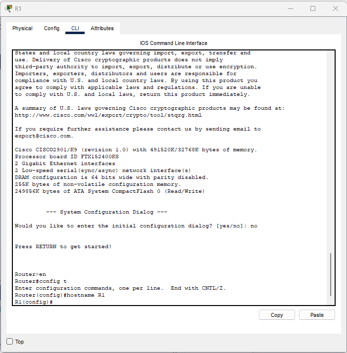
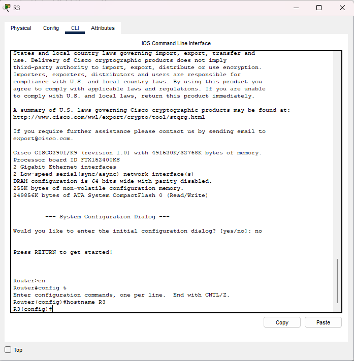
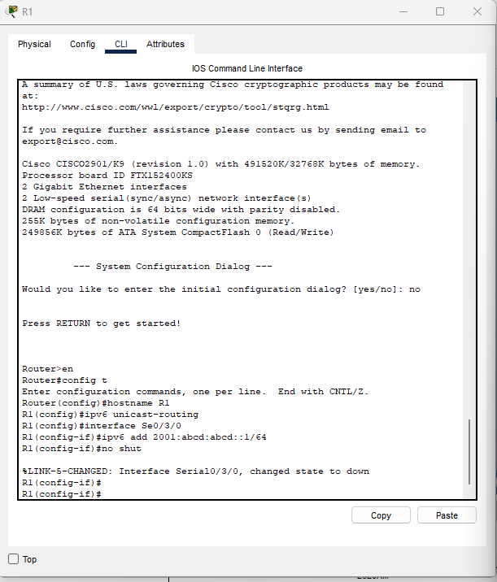
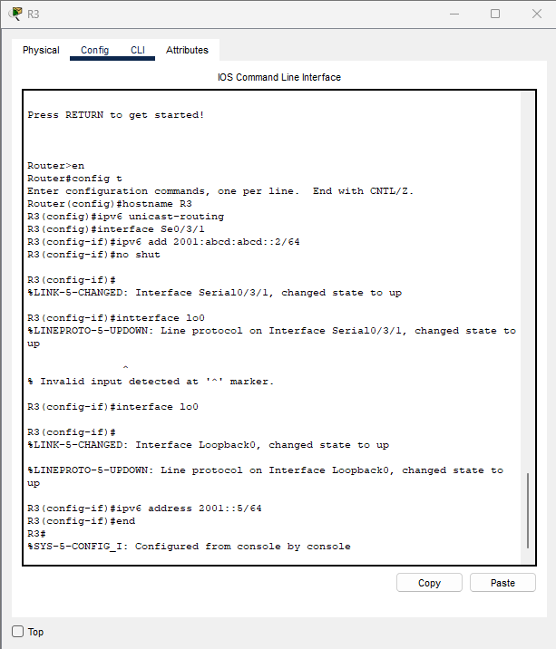
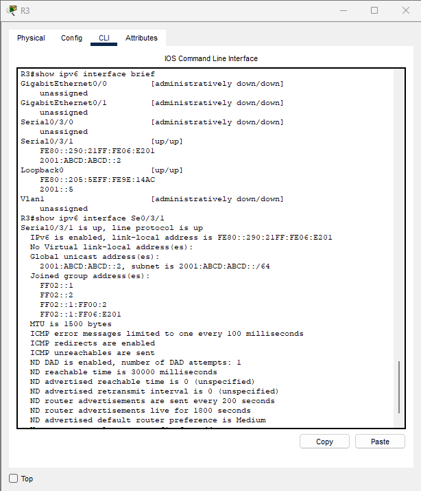

🧪 Lab 2 – Configure, Verify, and Troubleshoot IPv6 Addresses
101 Labs – CCNA (IPv6) — My Packet Tracer Implementation
📌 Lab Topology
Packet Tracer Screenshot

(R1 ↔ R3 Serial Connection)


✅ Task 1 — Configure Hostnames
R1 – Hostname Configuration


```bash
Router>en
Router#config t
Router(config)#hostname R1
R1(config)#
```

R3 – Hostname Configuration


```bash
Router>en
Router#config t
Router(config)#hostname R3
R3(config)#
```

✅ Task 2 — Configure IPv6 on Serial & Loopback Interfaces
R1 – IPv6 + Serial Interface


```bash
R1(config)#ipv6 unicast-routing
R1(config)#interface Serial0/3/0
R1(config-if)#ipv6 add 2001:abcd:abcd::1/64
R1(config-if)#no shut
```

R3 – IPv6 + Serial + Loopback


```bash
R3(config)#ipv6 unicast-routing
R3(config)#interface Serial0/3/1
R3(config-if)#ipv6 add 2001:abcd:abcd::2/64
R3(config-if)#no shut
```
Loopback0 IPv6
```bash
R3(config)#interface lo0
R3(config-if)#ipv6 address 2001::5/64
R3(config-if)#end
````
✅ Task 3 — Verify IPv6 Configuration
R3 – show ipv6 interface brief


```bash
R3#show ipv6 interface brief
Serial0/3/1          [up/up]
  FE80::290:21FF:F E06:E201
  2001:ABCD:ABCD::2

Loopback0            [up/up]
  FE80::205:5EFF:FE9E:14AC
  2001::5
```
📘 Summary of What Was Accomplished

✔ Hostnames set on R1 and R3
✔ IPv6 routing globally enabled
✔ Serial interfaces configured with IPv6 /64 addresses
✔ Loopback0 configured on R3
✔ Interfaces brought up
✔ Verification using:

show ipv6 interface brief

show ipv6 interface s0/3/1


