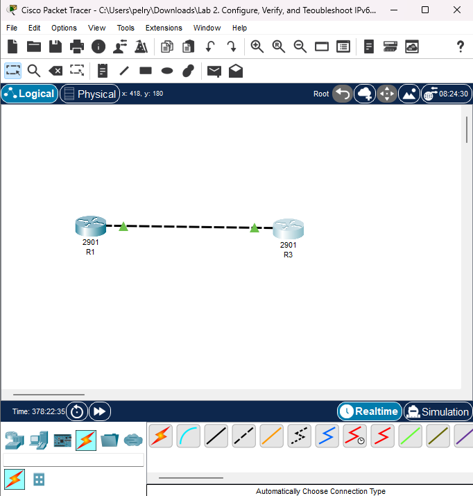

Lab 03 – IPv6 Address Autoconfiguration (SLAAC & EUI-64)
Based on 101 Labs – Lab 3. IPv6 Address Autoconfiguration 
101-labs-cisco-ccna-hands-on-practice

Objective
Configure IPv6 addressing on Cisco routers using:
Stateless Address Autoconfiguration (SLAAC)
EUI-64 host address generation

This lab reinforces IPv6 behavior, router advertisements, and automatic address formation.

Topology

Two routers (R1 and R3) connected on FastEthernet0/0 with an additional Loopback interface on R3.

Task 1 – Configure Hostnames
R1
