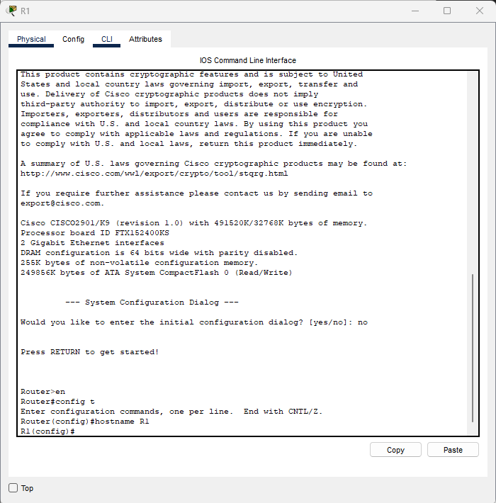
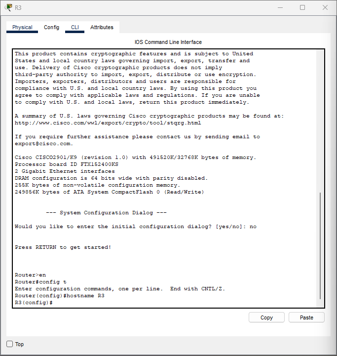
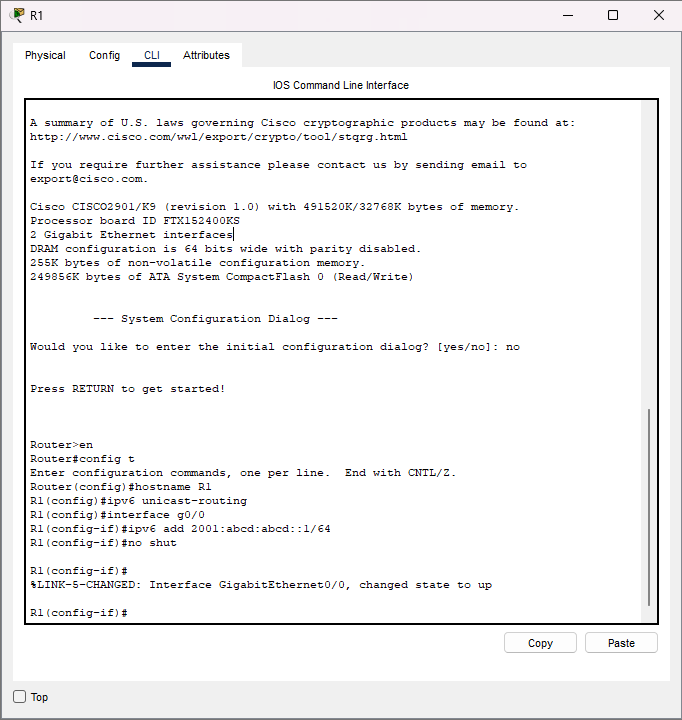
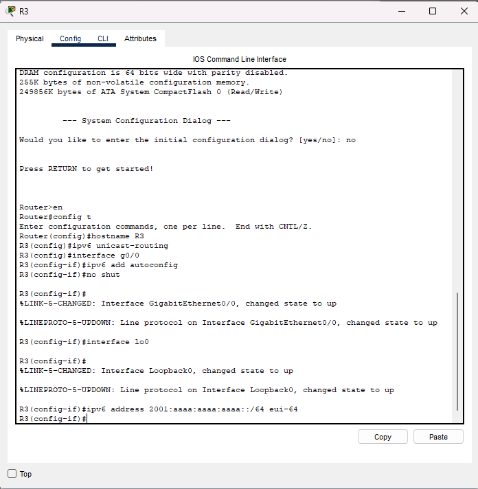
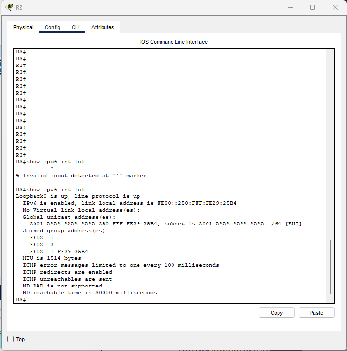

Lab 03 – IPv6 Address Autoconfiguration (SLAAC & EUI-64)
Based on 101 Labs – Lab 3. IPv6 Address Autoconfiguration 
101-labs-cisco-ccna-hands-on-practice

Objective
Configure IPv6 addressing on Cisco routers using:
Stateless Address Autoconfiguration (SLAAC)
EUI-64 host address generation

This lab reinforces IPv6 behavior, router advertisements, and automatic address formation.

Topology

Two routers (R1 and R3) connected on FastEthernet0/0 with an additional Loopback interface on R3.

Task 1 – Configure Hostnames
R1

```bash
Router#config t
Router(config)#hostname R1
R1(config)#end
```
R3 

```bash
Router#config t
Router(config)#hostname R3
R1(config)#end
```
Task 2 – Configure IPv6, SLAAC, and EUI-64
R1 – Enable IPv6 Routing & Assign Prefix

```bash
R1(config)#ipv6 unicast-routing
R1(config)#interface g0/0
R1(config-if)#ipv6 add 2001:abcd:abcd::1/64
R1(config-if)#no shut
```
R3 – Enable IPv6 Routing & Configure SLAAC

```bash
R3(config)#ipv6 unicast-routing
R3(config)#interface g0/0
R3(config-if)#ipv6 add autoconfig
R3(config-if)#no shut
```
```bash 
R3(config)#interface lo0
R3(config-if)# ipv6 address 2001:aaaa:aaaa:aaaa::/64 eui-64
```

Task 3 – Verification
Verify SLAAC & EUI-64

```bash
R3#show ipv6 interface lo0
R3#show ipv6 interface g0/0
```
Results

R3 GigaBitEthernet0/0 successfully obtained its IPv6 address using SLAAC.
R3 Loopback0 generated a valid IPv6 address using EUI-64.
IPv6 unicast routing enabled correctly on both routers.
Interfaces verified as up/up with valid link-local and global IPv6 addresses.


