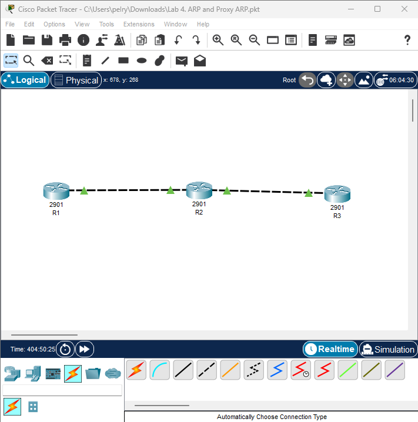
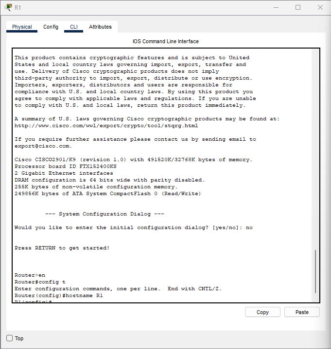
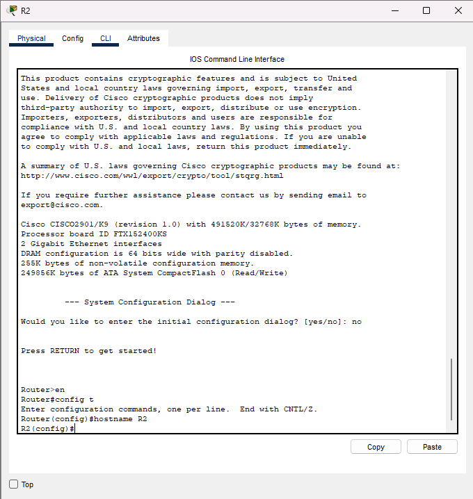
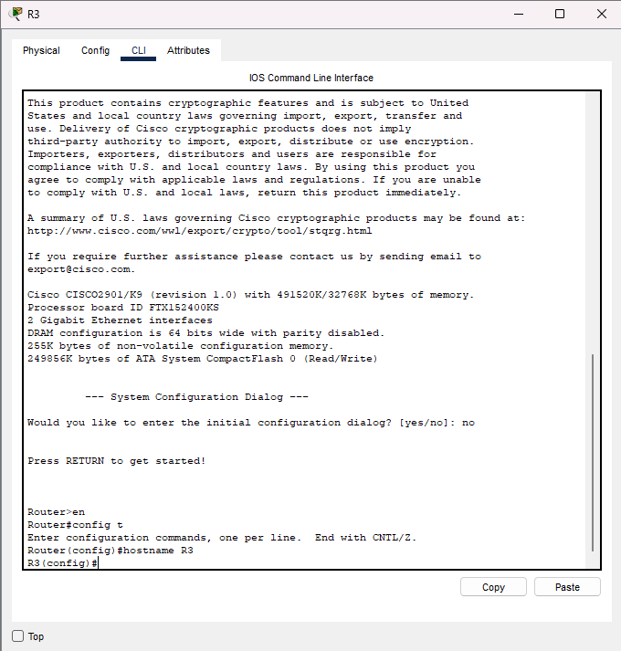
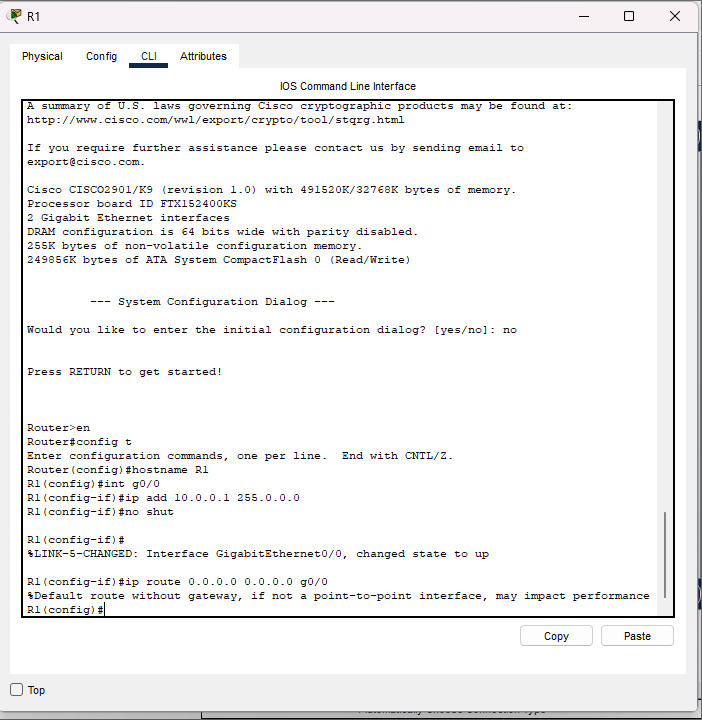
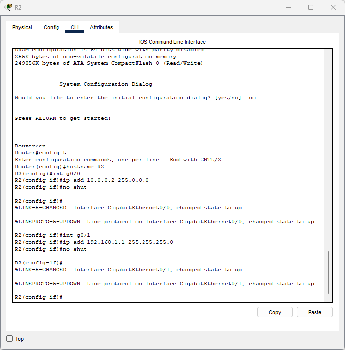
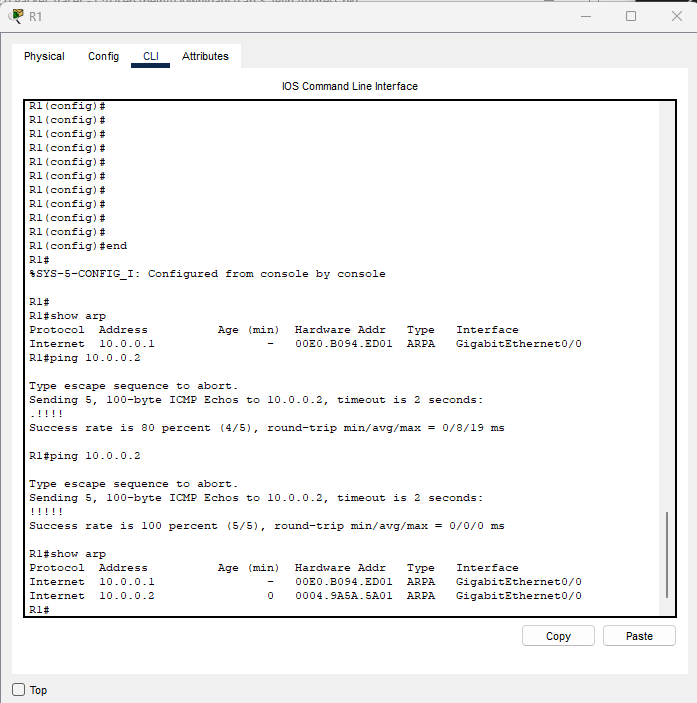
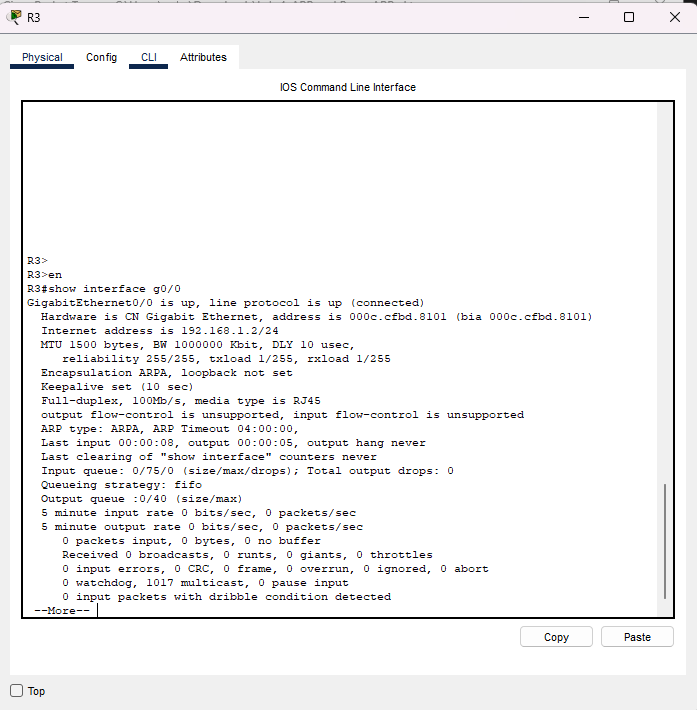

Lab 4 – ARP and Proxy ARP
Based on 101 Labs – CCNA

Lab Objective:
The objective of this lab is to understand how ARP operates on Cisco routers, how ARP entries are learned, and why Proxy ARP appears when traffic must traverse another router.

Lab Purpose
ARP is essential for Layer-2 to Layer-3 communication.
In this lab, I will verify ARP tables, observe ARP aging, and understand why R1 learns a MAC address that belongs to R2 when pinging R3.

Lab Topology
Three routers connected via FastEthernet:

R1 needs a route to reach R3, and R3 needs a route to return traffic.

Task 1 – Configure Hostnames
R1

```bash
Router#config t
Router(config)#hostname R1
R1(config)#end
```
R2

```bash
Router>en
Router#conf t
Router(config)#hostname R2
```
R3

```bash
Router>en
Router#conf t
Router(config)#hostname R3
```

Task 2 – Configure IP Interfaces and Static Routes
R1 – G0/0 + Default Route

```bash
R1(config)#interface g0/0
R1(config-if)#ip address 10.0.0.1 255.0.0.0
R1(config-if)#no shut
R1(config)#ip route 0.0.0.0 0.0.0.0 g0/0
```

R2 – Interfaces G0/0 and G0/1

```bash
R2(config)#interface g0/0
R2(config-if)#ip address 10.0.0.2 255.0.0.0
R2(config-if)#no shut

R2(config)#interface g0/1
R2(config-if)#ip address 192.168.1.1 255.255.255.0
R2(config-if)#no shut
```

R3 – G0/0 + Default Route

```bash
R3(config)#interface g0/0
R3(config-if)#ip address 192.168.1.2 255.255.255.0
R3(config-if)#no shut

R3(config)#ip route 0.0.0.0 0.0.0.0 g0/0
```

Task 3 – ARP Verification & Ping

```bash
R1#show arp
R1#ping 10.0.0.2
R1#ping 192.168.1.2
```

Task 4 - Router Verification 

```bash
R3#show int g0/0
```


