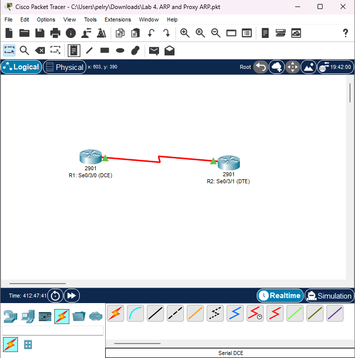
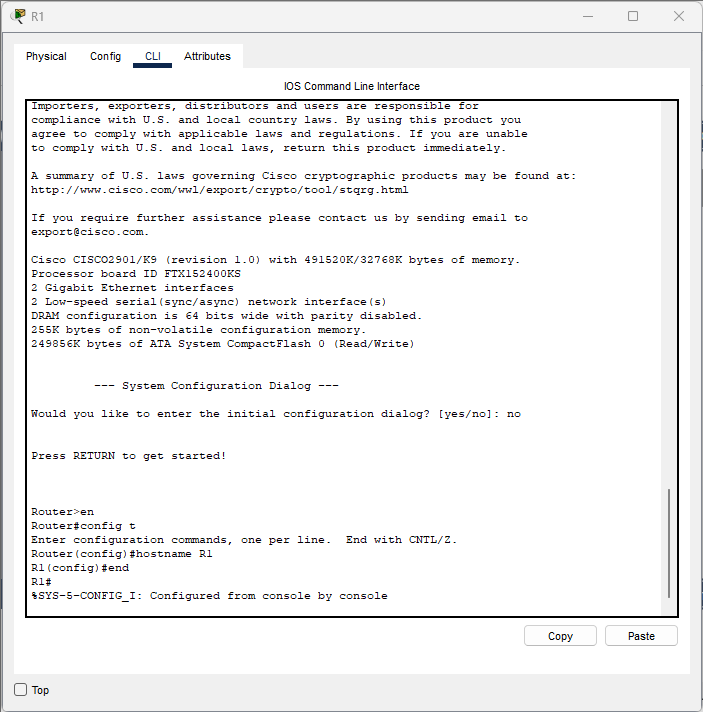
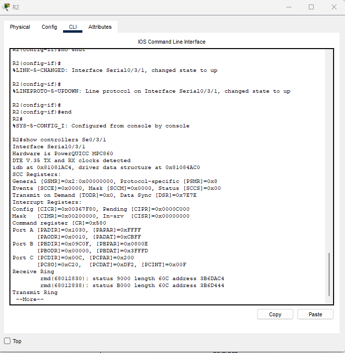
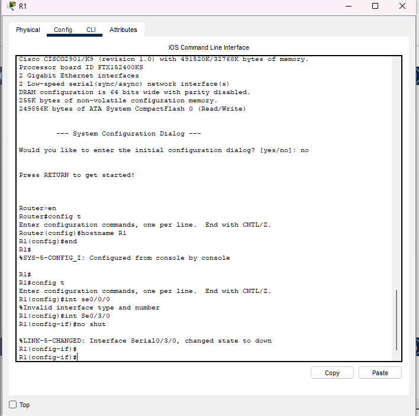
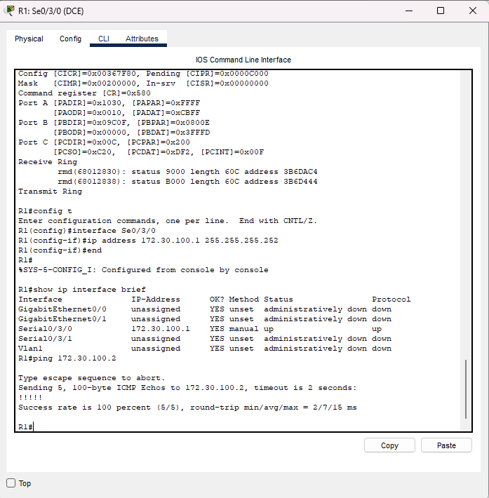
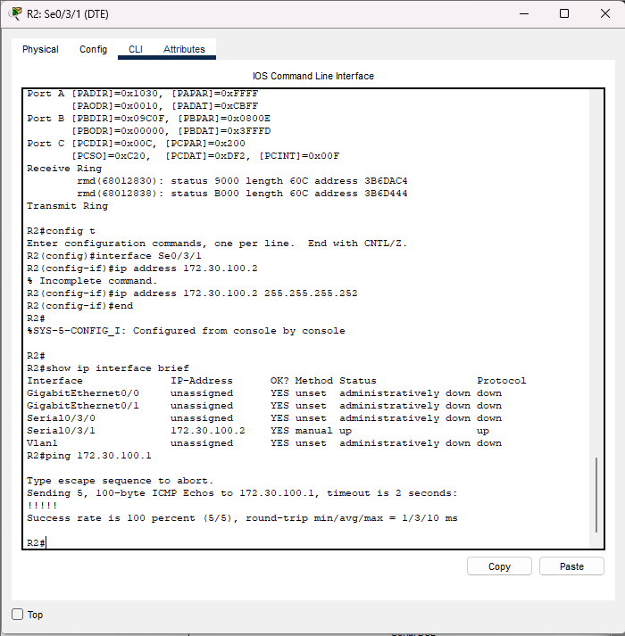

Lab 05 – Serial Interfaces, DCE/DTE, Clock Rate & Connectivity
Lab Objective

In this lab you will configure Serial interfaces on two routers, identify which router is DCE and which is DTE, apply a clock rate to the DCE side, then verify Layer-1 and Layer-3 connectivity using show controllers and ping tests.

Topology


Task 1 – Configure Hostnames
R1

```bash
Router>en
Router#conf t
Router(config)#hostname R1
```

R2

```bash
Router>en
Router#conf t
Router(config)#hostname R2
```

Task 2 – Identify DCE/DTE Roles Using show controllers
R1 – DCE

```bash
R1#show controllers Se0/3/0
Interface Serial0/3/0
Hardware is PowerQUICC MPC860
DCE V.35, clock rate 2000000
```
➡ R1 is the DCE (because it reports DCE V.35 and shows a clock rate).
➡ DCE side must supply clocking, so R1 will use the clock rate command.

R2 – DTE

```bash 
R2#show controllers Se0/3/1
Interface Serial0/3/1
Hardware is PowerQUICC MPC860
DTE V.35 TX and RX clocks detected
```
➡ R2 is DTE, meaning it receives clocking from R1 and does not set clock rate.

Task 3 – Configure Serial Interfaces

```bash 
R1 (DCE) – Serial0/3/0
R1(config)#interface Se0/3/0
R1(config-if)#ip address 172.30.100.1 255.255.255.252
R1(config-if)#clock rate 2000000
R1(config-if)#no shut
```
✔ Clock rate required because R1 is DCE
✔ Interface transitions:
LINEPROTO-5-UPDOWN indicates link is coming online.

R2 (DTE) – Serial0/3/1

```bash
R2(config)#interface Se0/3/1
R2(config-if)#ip address 172.30.100.2 255.255.255.252
R2(config-if)#no shut
```
✔ No clock rate needed because R2 is DTE

Task 4 – Verify Interface Status

```bash
R1 – show ip interface brief
R1#show ip interface brief
Interface       IP-Address      OK? Method Status      Protocol
Serial0/3/0     172.30.100.1    YES manual up          up
```
Ping from R1 → R2
```bash
R1#ping 172.30.100.2
!!!!!
Success rate is 100 percent (5/5)
```


R2 – show ip interface brief

```bash
R2#show ip interface brief
Interface       IP-Address      OK? Method Status      Protocol
Serial0/3/1     172.30.100.2    YES manual up          up
```
✔ Both routers show up/up → Layer-1 and Layer-2 operational.

Ping from R2 → R1
```bash
R2#ping 172.30.100.1
!!!!!
Success rate is 100 percent (5/5)
```
✔ Layer-3 connectivity confirmed.

Task 6 – Final DCE/DTE Verification
R1 – DCE
Shown by:

DCE V.35
clock rate 2000000
R2 – DTE

Shown by:

DTE V.35
No clock rate displayed

Summary
Router	Role	Interface	IP Address	Notes
R1	DCE	S0/3/0	172.30.100.1/30	Supplies clock rate
R2	DTE	S0/3/1	172.30.100.2/30	Receives clock

✔ Serial link fully operational
✔ Proper DCE/DTE identification
✔ Clocking configured correctly
✔ Connectivity verified


