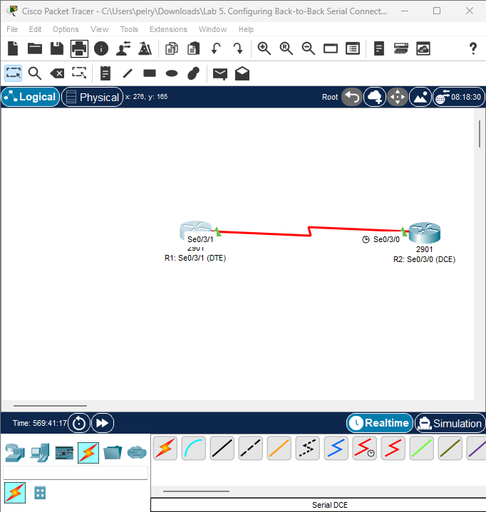
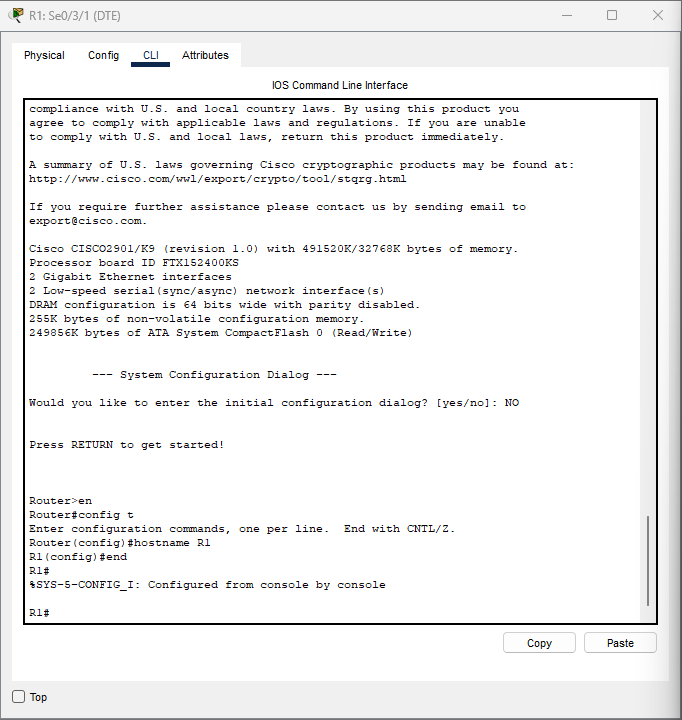

Lab: Verifying Cisco HDLC Encapsulation on Serial Interfaces
📘 Objective

The objective of this lab is to verify Cisco HDLC encapsulation, which is the default Layer 2 encapsulation used on point-to-point serial interfaces on Cisco IOS routers.
You will examine interface configuration, controller information, DCE/DTE roles, and interface status to confirm proper HDLC operation.

📡 Topology

```bash
R1 Serial0/3/1 — DTE
R2 Serial0/3/0 — DCE (Clock rate will be manually configured)
```
📝 Lab Requirements
Cisco routers (Packet Tracer 2901 platform)
Serial interfaces available (S0/3/1 & S0/3/0)

Ability to run:
show interface
show controllers
encapsulation hdlc (default, no config needed)
clock rate (on DCE side)

🔧 Step-by-Step Configuration
1️⃣ Set Hostnames
R1

```bash
Router> enable
Router# configure terminal
Router(config)# hostname R1
```

R2

```bash
Router> enable
Router# configure terminal
Router(config)# hostname R2
```
2️⃣ Enable Serial Interfaces
R1 – DTE

```bash
R1(config)# interface Serial0/3/1
R1(config-if)# no shutdown
```
R2 – DCE

```bash
R2(config)# interface Serial0/3/0
R2(config-if)# no shutdown
```
3️⃣ Set Clock Rate on the DCE Side
Because R2 has the DCE cable, it must provide clocking.

```bash
R2(config)# interface Serial0/3/0
R2(config-if)# clock rate 250000
```
🔍 Verification Steps
4️⃣ Verify HDLC Encapsulation (Default)
On both routers:
R1

```bash
show interfaces Serial0/3/1
```
You should see:
```bash
Encapsulation HDLC
```

R2

```bash
show interfaces Serial0/3/0
```
You should see:
```bash
Encapsulation HDLC
```

5️⃣ Verify the Physical and Data-Link Layer (Layer 1/2)
Run:

R1
 
```bash
show controllers Serial0/3/1
```
This confirms:
Whether the interface is DCE or DTE
Clock rate (if DCE)
Hardware driver values
RX/TX ring status

R2

```bash
show controllers Serial0/3/0
```
This confirms:
Whether the interface is DCE or DTE
Clock rate (if DCE)
Hardware driver values
RX/TX ring status

6️⃣ Clear Debug Output (If Used)
If you attempted debugging earlier:

```bash
undebug all
```

✔ Expected Results
Both serial interfaces should come UP/UP.
Encapsulation HDLC is visible under the interface details.
R2 should show a Clock rate under show controllers.
No Layer 1 or Layer 2 errors should appear.

📌 Notes About Packet Tracer Limitations
Packet Tracer does not support real-time HDLC frame debugging such as:
```bash
debug hdlc packet
debug serial interface
```
These work on real hardware and in GNS3/EVE-NG but are not implemented on PT 2901 routers.
Because of that limitation:

You will not get HDLC frame-by-frame debugging output in Packet Tracer.
Use show interfaces and show controllers for verification instead.


