Lab 7 — Configuring & Verifying PPP Encapsulation on Serial Links
🎯 Lab Objective
The objective of this lab exercise is to:
Enable PPP encapsulation on Cisco router Serial interfaces
Verify PPP link state, negotiation, and encapsulation
Use debugging tools to observe PPP negotiation phases
Validate successful PPP operation using CLI verification commands

📘 Lab Purpose
Point-to-Point Protocol (PPP) is one of the most widely deployed Layer 2 WAN protocols.
As a Cisco engineer — and especially as a CCNA candidate — you must be able to:
Configure PPP encapsulation
Verify PPP link status
Understand LCP negotiation & phases
Debug PPP negotiation failures
Identify DTE/DCE roles and clocking requirements

🖥️ Network Topology
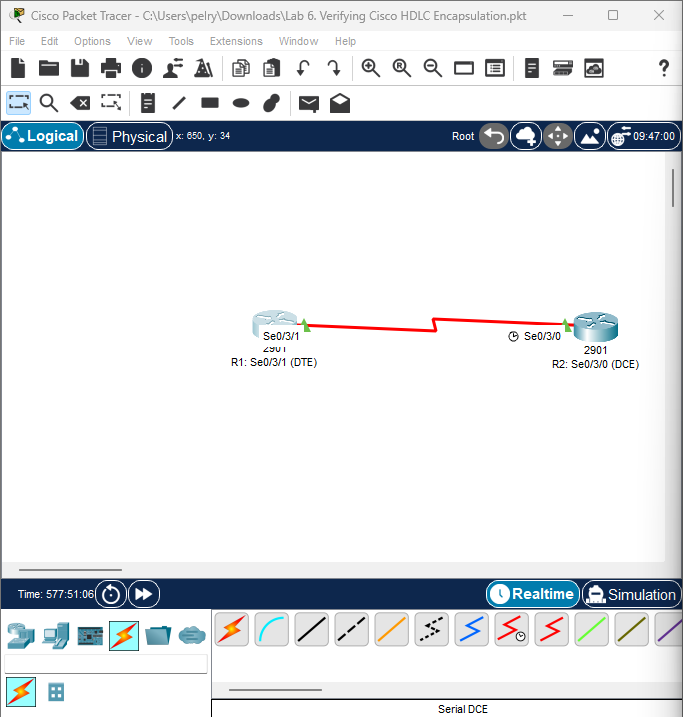

🔧 Device Roles
Device	Interface	Role
R1	Serial0/3/1	DTE
R2	Serial0/3/0	DCE
🟦 Initial Device Setup (Hostname Configuration)

R2 — Hostname Configuration
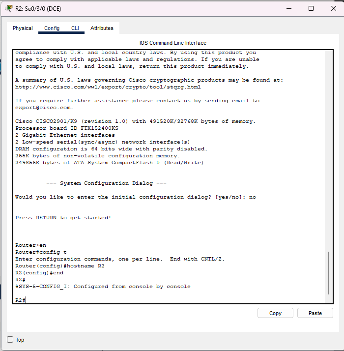

```bash
Router> enable
Router# configure terminal
Router(config)# hostname R2
R2(config)# end
```

R1 — Hostname Configuration
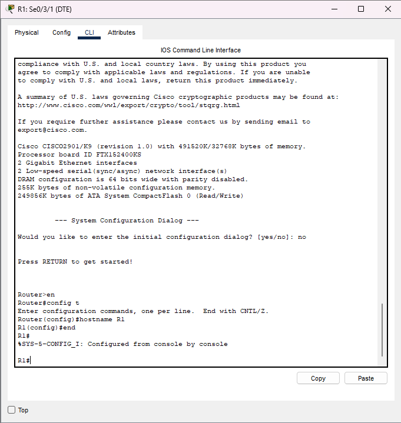
```bash
Router> enable
Router# configure terminal
Router(config)# hostname R1
R1(config)# end
```
Clear Existing Debug Settings
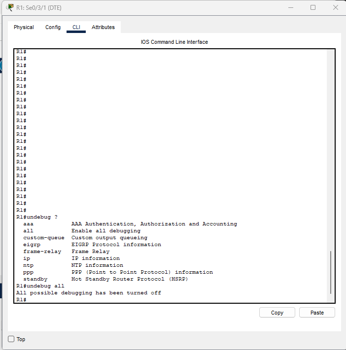
```bash
R1# undebug all
```

PPP Encapsulation on R1

```bash
R1(config)# interface Serial0/3/1
R1(config-if)# encapsulation ppp
R1(config-if)# ip address 10.0.254.1 255.255.255.240
R1(config-if)# no shutdown
```

PPP Encapsulation on R2
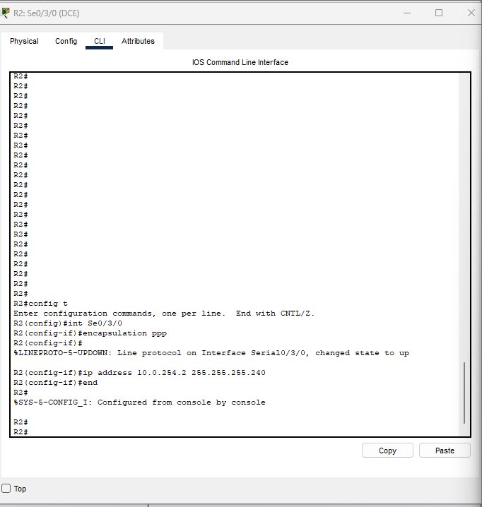
```bash
R2(config)# interface Serial0/3/0
R2(config-if)# encapsulation ppp
R2(config-if)# ip address 10.0.254.2 255.255.255.240
R2(config-if)# no shutdown
```

DCE Clock Rate (R2 Only)
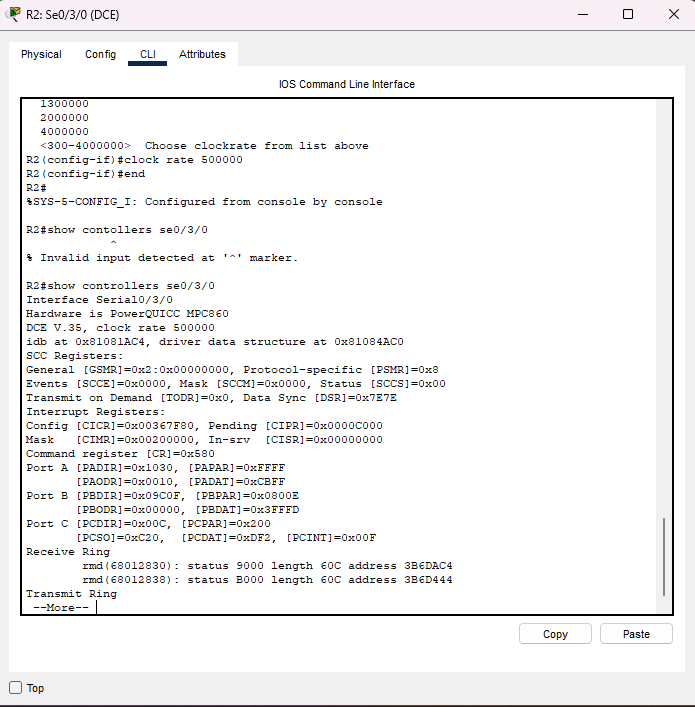
```bash
R2(config)# interface Serial0/3/0
R2(config-if)# clock rate 2000000
```

Debug PPP Negotiation
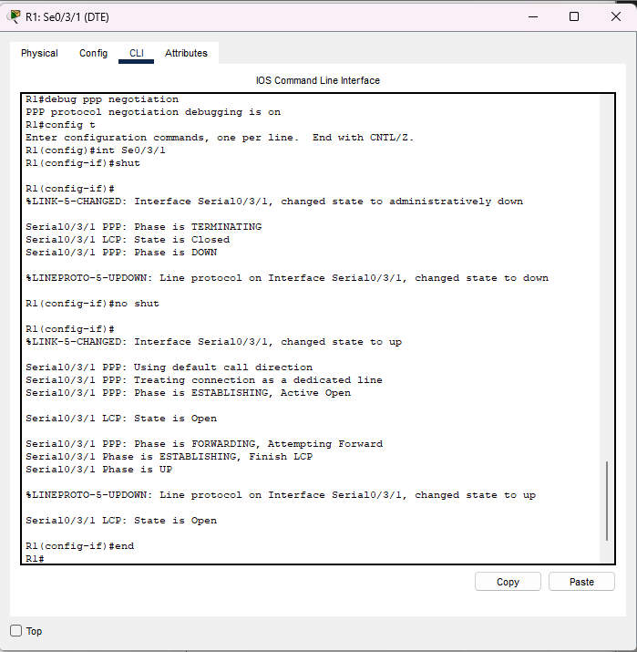
```bash
R1# debug ppp negotiation
```

📡 Verification
Verify Serial Interface Status on R1
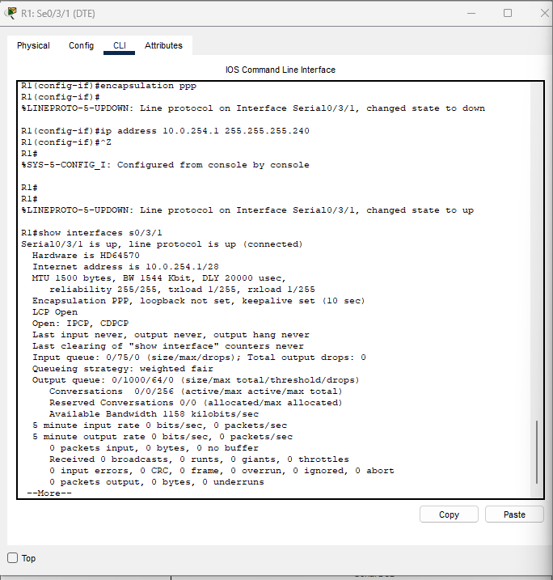

Expected output includes:
Encapsulation PPP
LCP Open
Interface up/up

```bash
R1# show interface Serial0/3/1
```

Verify DCE/DTE and Clock Rate on R2
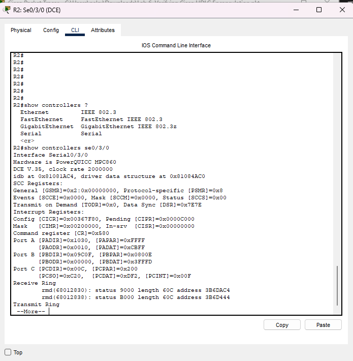

```bash
R2# show controllers Serial0/3/0
```

Final Interface Configurations
R1
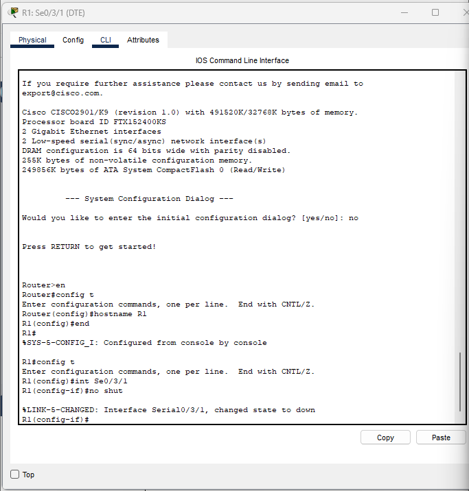

R2
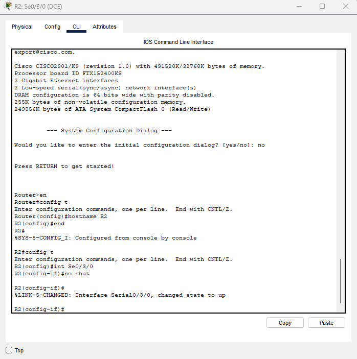

✅ End of Lab Summary
✔ Configure PPP encapsulation
✔ Observe PPP negotiation via debugging tools
✔ Verify PPP status using show commands
✔ Identify DCE/DTE roles
✔ Configure clocking on the DCE side
Mastering PPP is essential preparation for real-world WAN engineering.


