Configuring PPP Encapsulation & PAP Authentication on Serial Interfaces

Lab Objectiive:
The objective of this lab is to configure PPP encapsulation on Cisco router serial interfaces, implement PAP authentication, verify PPP negotiation, and analyze interface behavior using real-time debug output.

Lab Purpose
This lab develops core WAN engineering skills. 

Configure basic serial interfaces
Set DCE clock rates
Apply PPP encapsulation
Configure PAP authentication
Create local username/password databases
Verify interface state, PPP negotiation, and LCP phases
Interpret authentication failures and successes

Network Topology
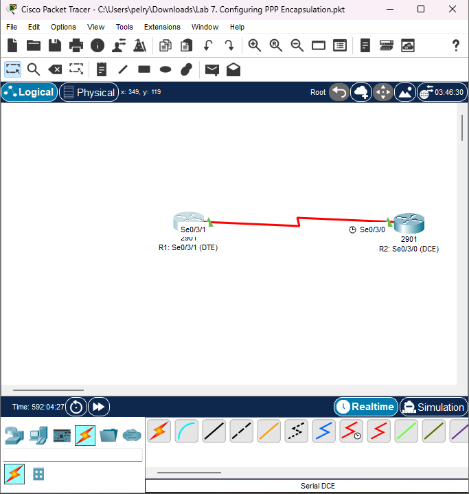
```bash
Device	Role	Interface	IP Address	Subnet Mask
R1	DTE	Se0/3/1	10.0.254.1	255.255.255.240
R2	DCE	Se0/3/0	10.0.254.2	255.255.255.240
```

Initial Router Setup
1. Hostname Configuration
R1 Hostname
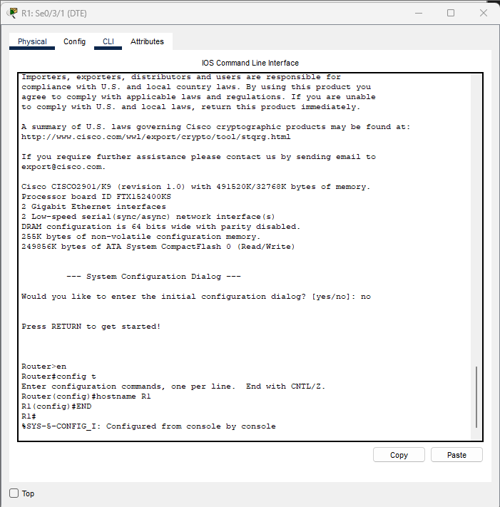

R2 Hostname
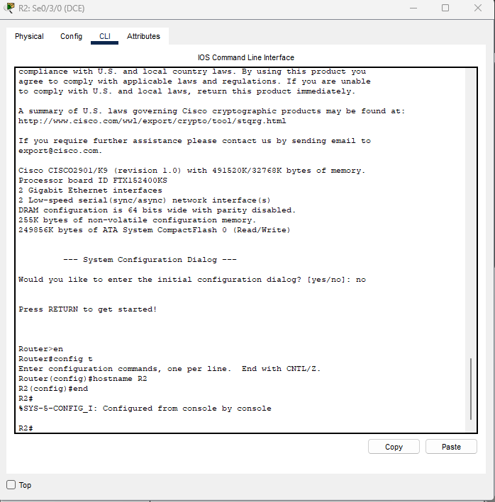 

Serial Interface Setup
R1: Serial Interface Configuration
```bash 
interface Se0/3/1
 no shutdown
 encapsulation ppp
 ip address 10.0.254.1 255.255.255.240
```
Screenshot:
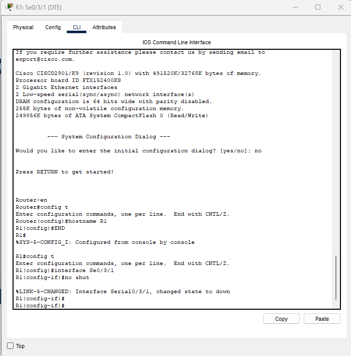

R2: Serial Interface Configuration (DCE)
DCE side requires a clock rate.
```bash 
interface Se0/3/0
 no shutdown
 clock rate 8000000
 encapsulation ppp
 ip address 10.0.254.2 255.255.255.240
```
 Screenshot (clock rate):
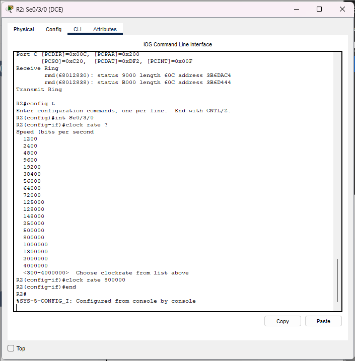

Scrterface config):
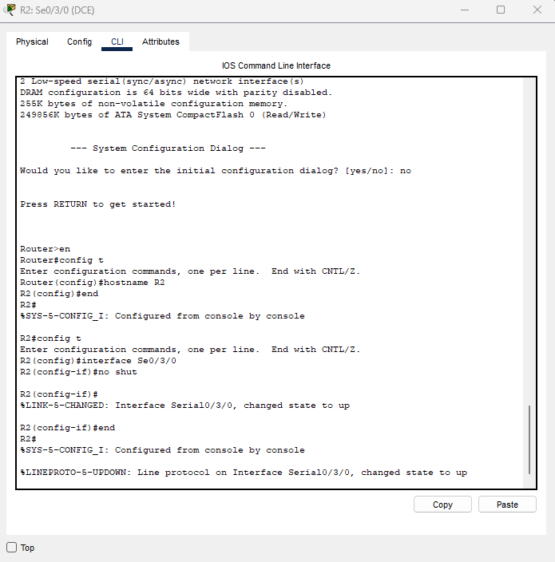

Verifying DCE Cable (R2)
The DCE router provides the clocking.
Verification using:
show controllers Se0/3/0
Expected:
Hardware: DCE V.35
Clock rate: set to 8000000
Screenshot:
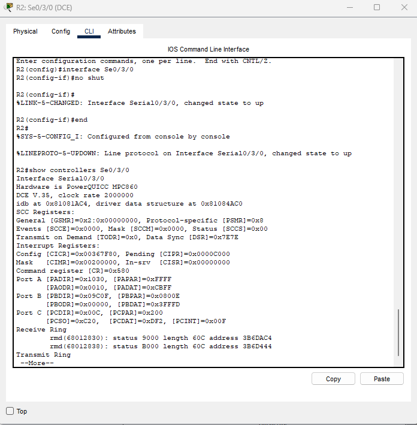

Configuring PPP Encapsulation
R1 PPP Encapsulation
interface Se0/3/1
 encapsulation ppp
```bash 
 interface Se0/3/1
 encapsulation ppp
```
Screenshot:


R2 PPP Encapsulation
```bash 
interface Se0/3/0
 encapsulation ppp
```

Screenshot:
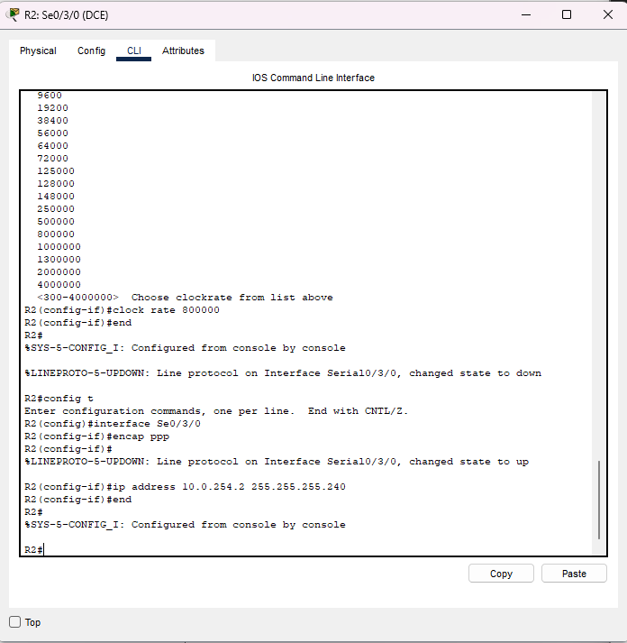


Configuring PAP Authentication
Create Local User Accounts
R1:
```bash
username R2 password PAP
```
R2:
```bash 
username R1 password PAP
```
Screenshots:
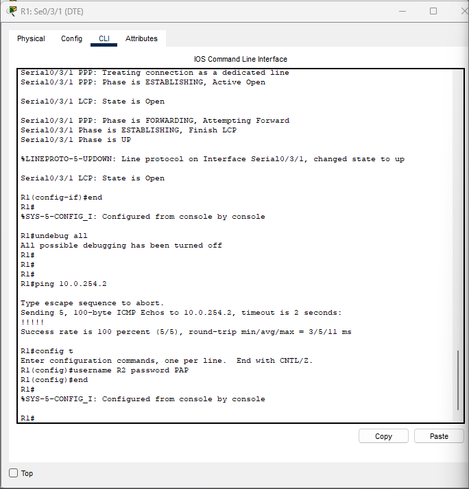
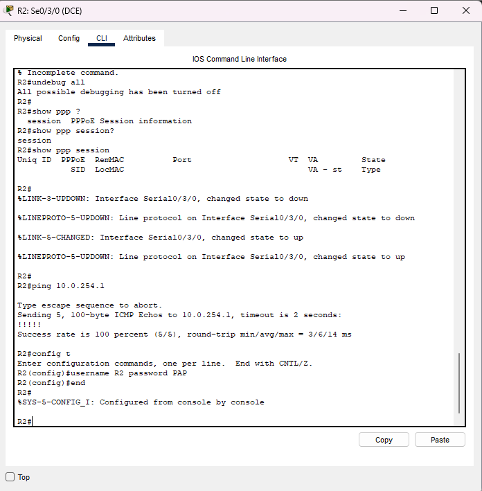

Apply Authentication on Interfaces
R1
```bash 
interface Se0/3/1
 ppp authentication pap
 ppp pap sent-username R1 password PAP
```
R2
```bash
interface Se0/3/0
 ppp authentication pap
 ppp pap sent-username R2 password PAP
```
Screenshots:
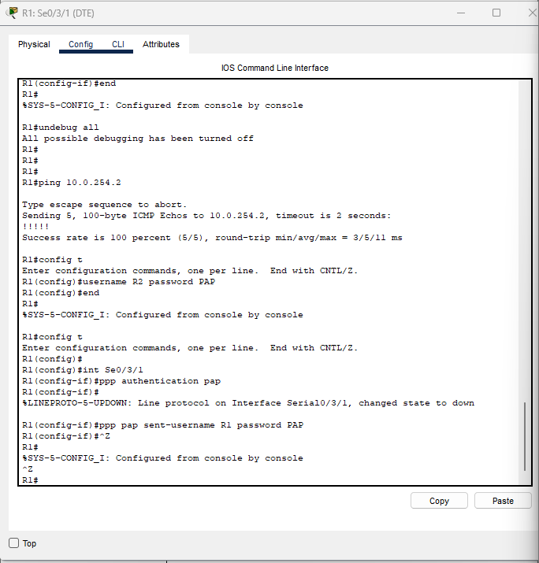


Debugging PPP Negotiation
Enable debugging:
```bash 
debug ppp negotiation
```
Disable:
undebug all
```bash
undebug all
```

Screenshot examples:
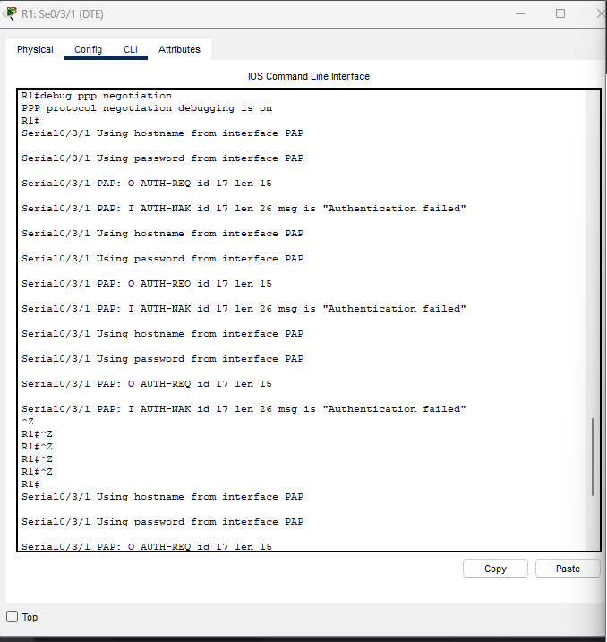

What to look for:
Message	Meaning
LCP: State is Open	Link is established
AUTH-REQ	Username/password sent
AUTH-ACK	Authentication successful
AUTH-NAK	Authentication failed
PPP Phase is UP	Link fully established

PPP Session Verification
R2:
```bash 
show ppp session
```
R1:
```bash
show interfaces se0/3/1
```
Screenshots:
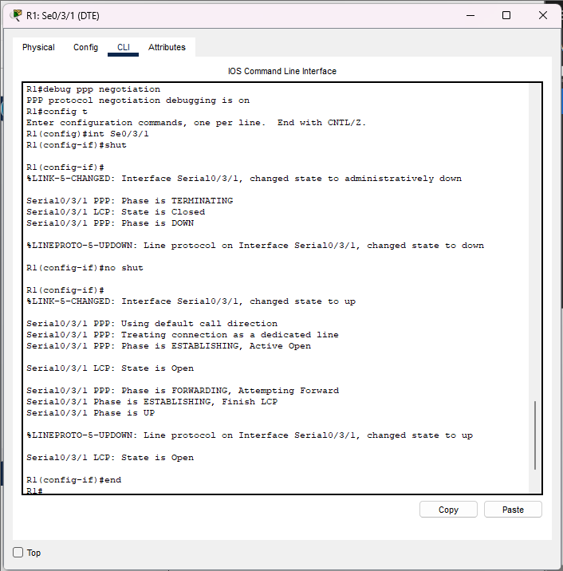
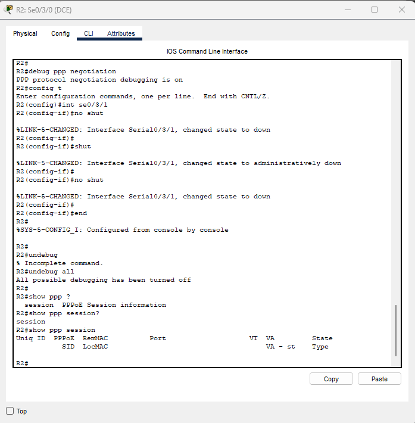

Connectivity Testing
Ping from R1 → R2
```bash
ping 10.0.254.2
```

Ping from R2 → R1
```bash
ping 10.0.254.1
```

Screenshots:
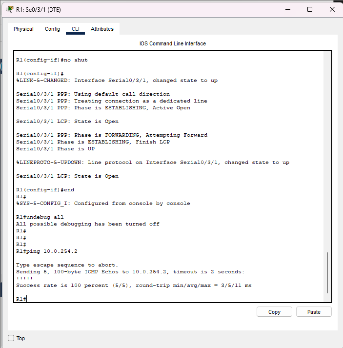
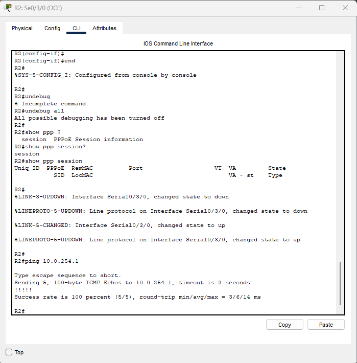

Troubleshooting Notes
Issue	Explanation
Authentication failed	Wrong username/password or mismatch
LCP not opening	No clock rate, wrong encapsulation, interface shutdown
PAP only active on one side	Must match on both sides
Packet Tracer limitation	Some PPP debugging not fully supported on 2901 platform

Final Results
✅ PPP encapsulation successful
✅ PAP authentication successful
✅ LCP state is OPEN
✅ Interfaces UP/UP
✅ Full end-to-end ping connectivity


