# Lab 09 — PPP Authentication (CHAP) over Serial  
**Platform:** Cisco Packet Tracer  
**Routers:** Cisco 2901  
**Proof of Work**

---

## Lab Objective
Configure and verify **PPP encapsulation with CHAP authentication** between two Cisco routers over a serial WAN link.  
Validate Layer 1, Layer 2, and authentication states, and confirm end-to-end IP connectivity.

---

## Network Topology

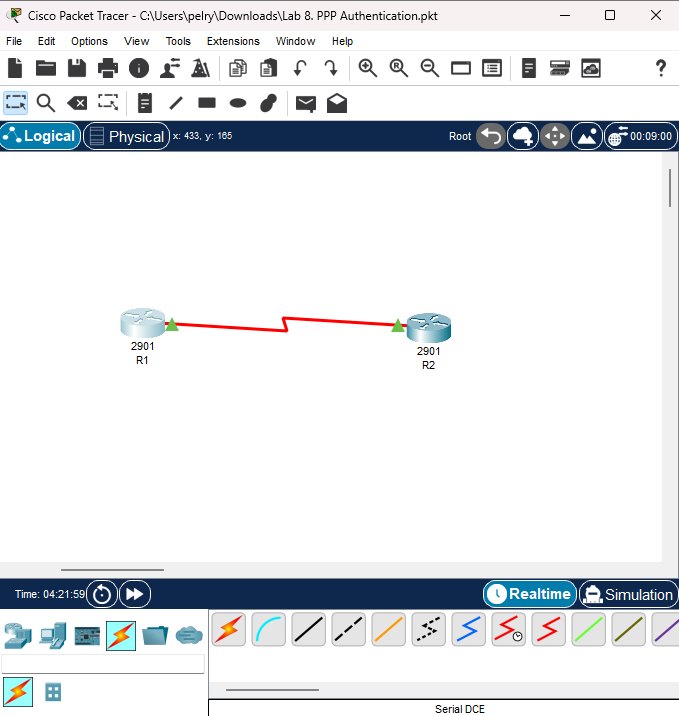

---

## Addressing Scheme

| Device | Interface | IP Address | Subnet Mask |
|------|----------|------------|-------------|
| R1 | Serial0/3/1 | 192.168.50.33 | 255.255.255.224 |
| R2 | Serial0/3/0 | 192.168.50.34 | 255.255.255.224 |

Subnet: `192.168.50.32/27`

---

## Step 1 — Device Initialization & Hostnames

### R1 Hostname Configuration
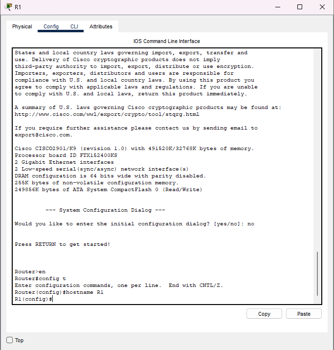

### R2 Hostname Configuration
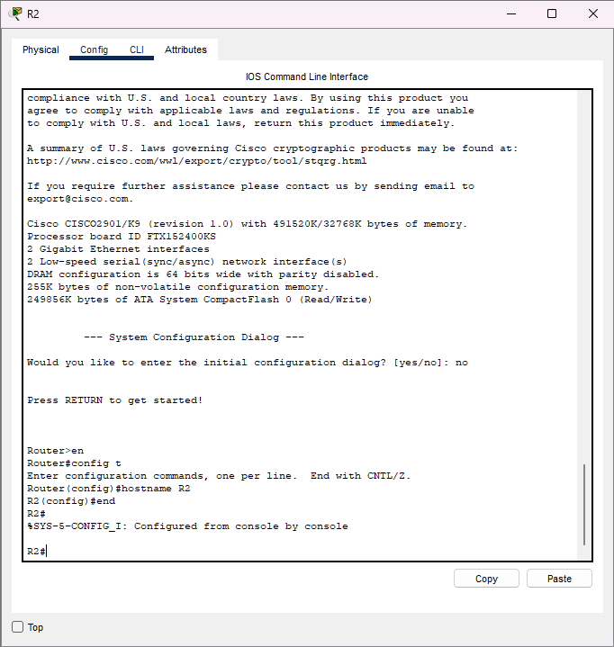

---

## Step 2 — Serial Interface IP Configuration

### R1 Serial Interface Configuration
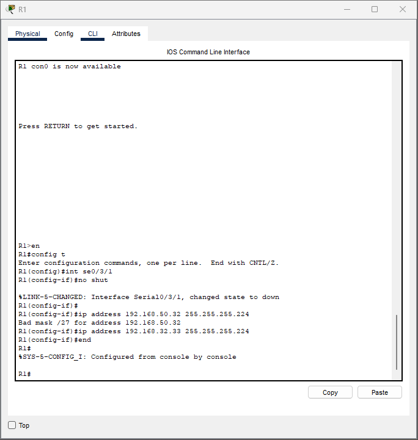

### R2 Serial Interface Configuration
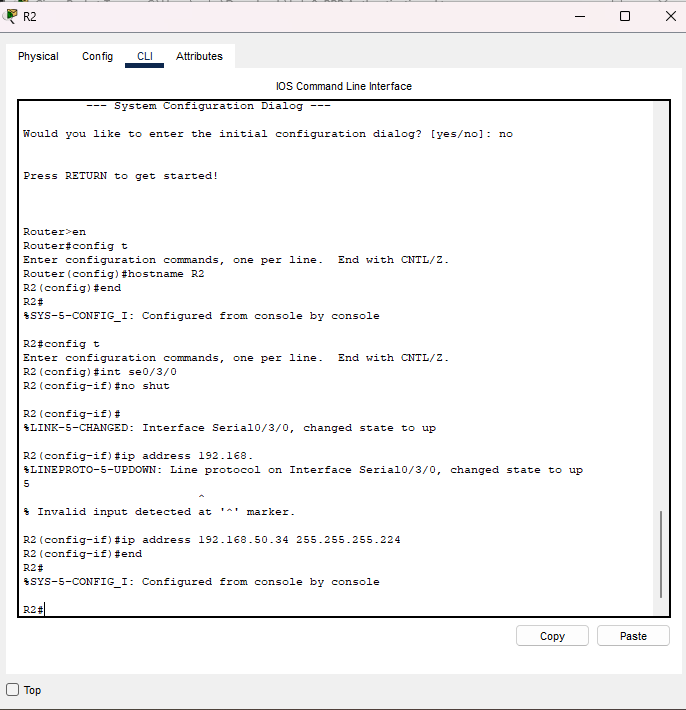

> Note: Interfaces were initially shut down and brought up manually using `no shutdown`.

---

## Step 3 — DCE/DTE Verification and Clock Rate

### R1 Controller Verification
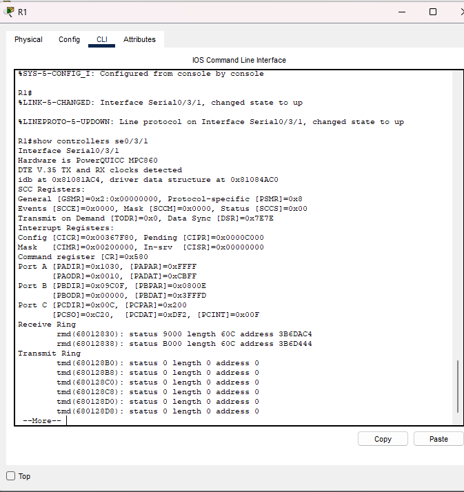

### R2 Controller Verification
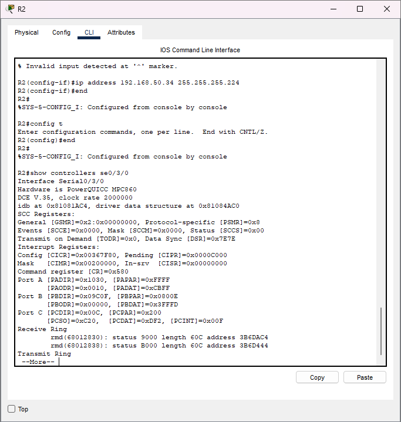

### Clock Rate Configuration on DCE Side (R2)
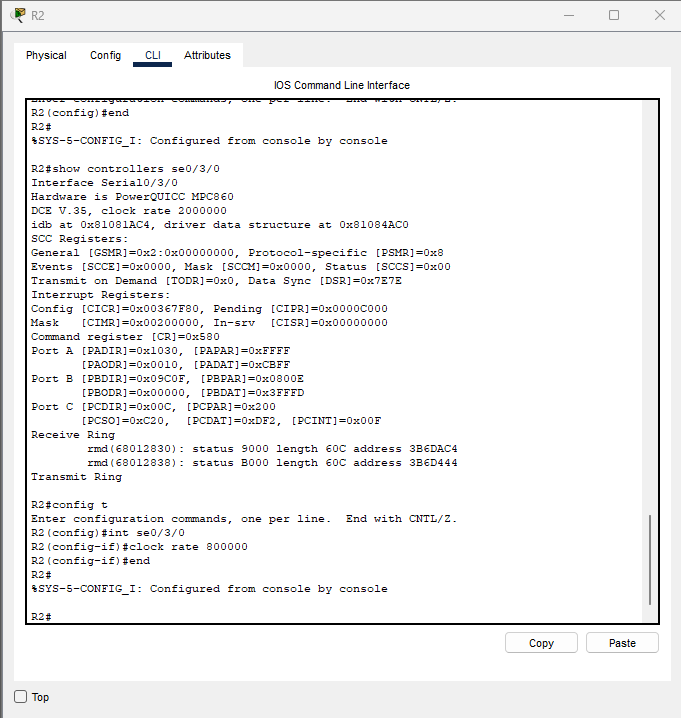

> Clock rate was required on the DCE interface to maintain line protocol stability.

---

## Step 4 — PPP Encapsulation

### R1 PPP Encapsulation
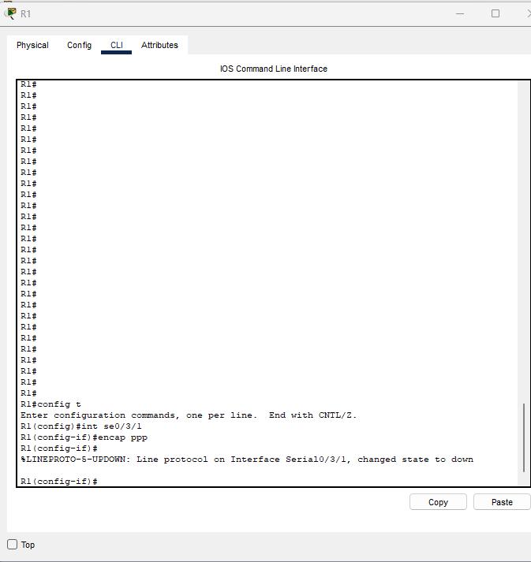

### R2 PPP Encapsulation


> Default HDLC encapsulation was replaced with PPP on both routers.

---

## Step 5 — CHAP Authentication Configuration

### R1 CHAP Configuration
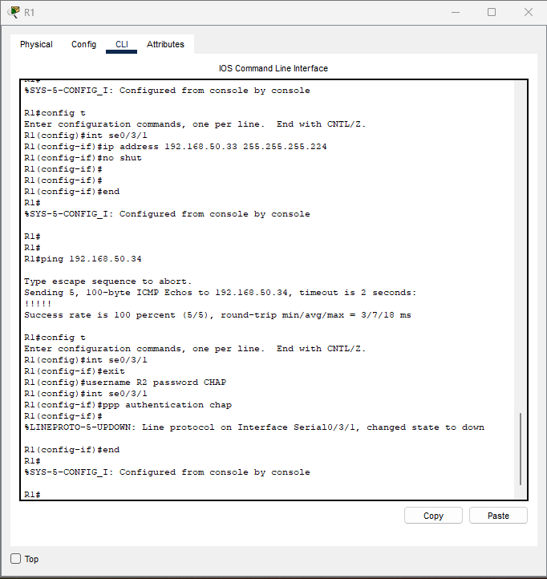

### R2 CHAP Configuration
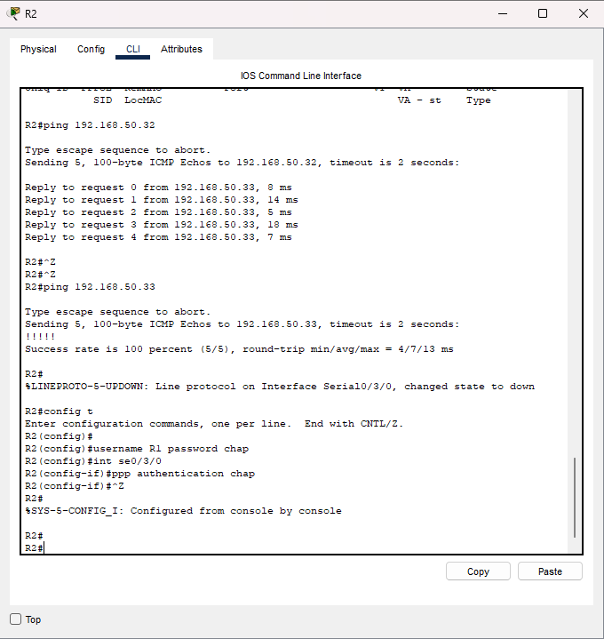

**Key CHAP Requirement:**
- Username **must match the remote router hostname**
- Password must be identical on both sides

---

## Step 6 — PPP Session Verification

### R1 PPP Verification
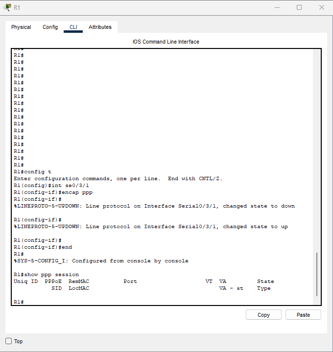

### R2 PPP Verification
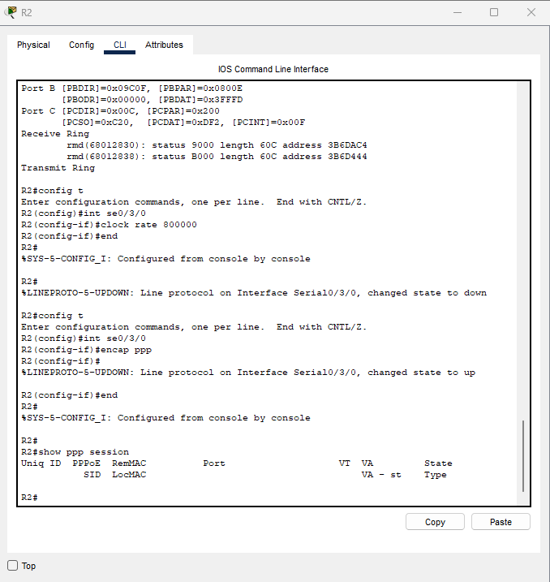

> PPP session established successfully after CHAP authentication.

---

## Step 7 — Connectivity Testing

### Ping Test from R1 to R2
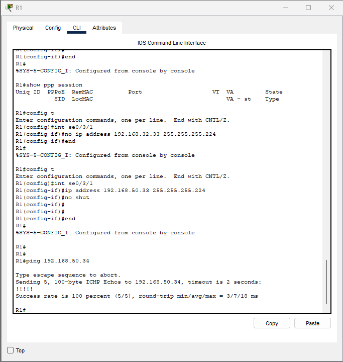

### Ping Test from R2 to R1
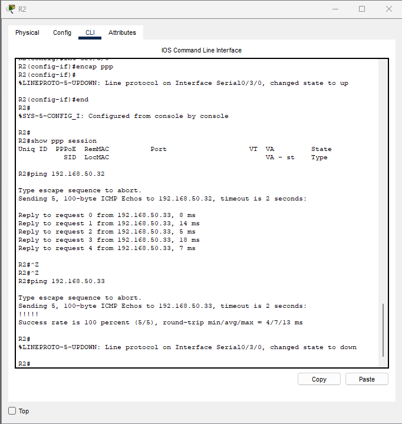

> 100% success rate confirms full Layer 3 connectivity.

---

## Debugging & Operational Notes

### Clearing Active Debugs
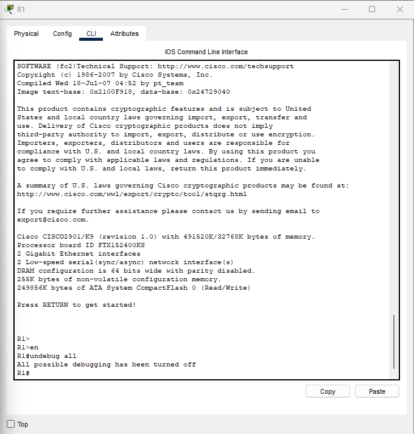

```bash
undebug all
```
Issues Encountered (Packet Tracer Behavior)
Line protocol intermittently changed state during:
Encapsulation changes
CHAP enablement
Clock rate adjustments
Packet Tracer sometimes reports invalid input when commands are entered during interface state transitions.
PPP negotiation may not appear in show ppp session despite functional connectivity — a Packet Tracer limitation.

Key Takeaways
PPP authentication occurs after Layer 1 and Layer 2 come up
CHAP failures will cause line protocol drops
DCE clock rate is mandatory for stable serial links
Hostname consistency is critical for CHAP authentication
Packet Tracer does not fully emulate all IOS PPP debug outputs

Lab Status
✅ Completed Successfully
✔ PPP Encapsulation
✔ CHAP Authentication
✔ Serial WAN Link Stability
✔ End-to-End Connectivity

Evidence
All screenshots used in this proof of work are stored in the repository under:
```bash
/screenshots/
```

This lab demonstrates practical WAN configuration, authentication control, and troubleshooting skills


