# Lab 11 – eBGP Configuration & Verification (Packet Tracer)

## 📌 Lab Overview
This lab demonstrates the configuration and verification of **External BGP (eBGP)** between two Cisco routers using **Cisco Packet Tracer**.

This README serves as **proof of work**, documenting:
- Successful configurations
- Verification commands and outputs
- IOS feature limitations encountered in Packet Tracer

Errors shown do **not** indicate incorrect commands, but rather **platform limitations**.

---

## 🎯 Lab Objectives
- Configure router hostnames
- Configure Gigabit and Loopback interfaces
- Establish Layer 3 reachability using static routes
- Configure and verify eBGP peering
- Advertise networks using BGP
- Identify unsupported IOS features in Packet Tracer

---

## 🧱 Network Topology

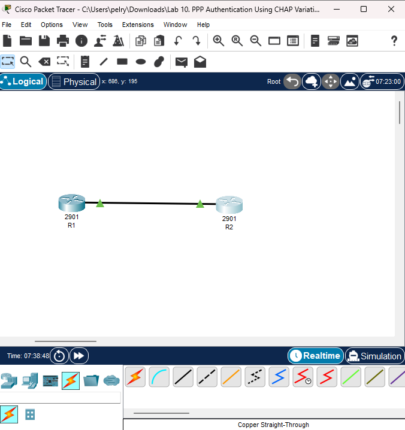

---

## 🔧 Device Initialization

### Router Hostnames

**R1 Hostname Configuration**  
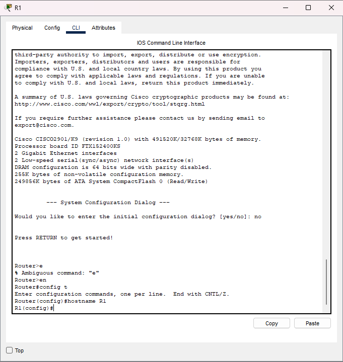

**R2 Hostname Configuration**  
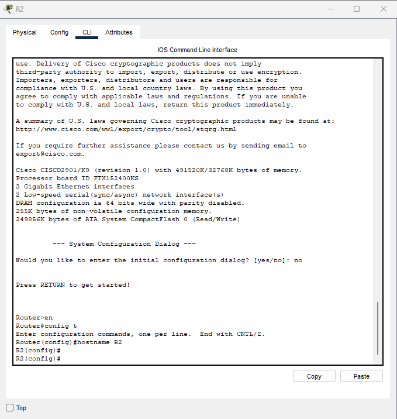

---

## 🌐 Interface Configuration

### R1 Interface Setup
- GigabitEthernet0/0 → `192.168.10.1/24`
- Loopback1 → `192.168.1.1/24`
- Loopback100 → `192.168.100.1/24`

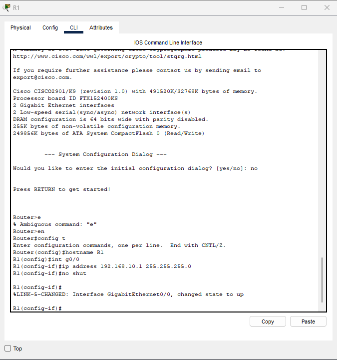  

---

### R2 Interface Setup
- GigabitEthernet0/1 → `192.168.10.2/24`
- Loopback1 → `192.168.2.1/24`
- Loopback200 → `192.168.200.1/24`

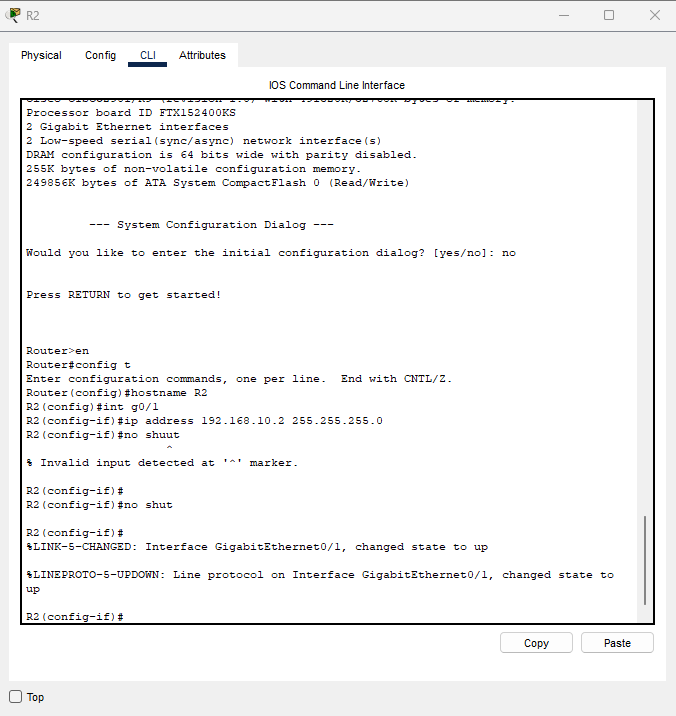  

---

## 🛣️ Static Routing Configuration

Static routes were configured to ensure reachability between Loopback networks before BGP establishment.

### R1 Static Route
- Destination: `192.168.200.0/24`
- Next hop: `192.168.10.2`

---

### R2 Static Route
- Destination: `192.168.100.0/24`
- Next hop: `192.168.10.1`

---

## 🔁 eBGP Configuration

### R1 – eBGP (AS 100)

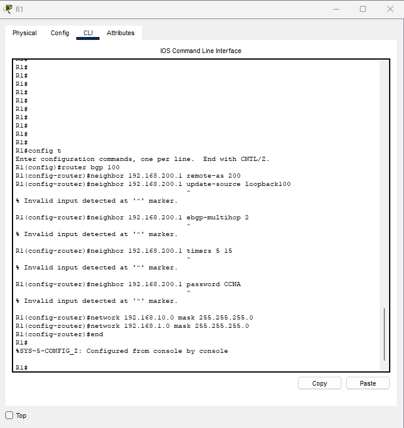

- Neighbor: `192.168.200.1`
- Remote AS: `200`
- Networks advertised:
  - `192.168.10.0/24`
  - `192.168.1.0/24`
  - `192.168.100.0/24`

---

### R2 – eBGP (AS 200)

- Neighbor: `192.168.100.1`
- Remote AS: `100`
- Networks advertised:
  - `192.168.10.0/24`
  - `192.168.2.0/24`
  - `192.168.200.0/24`

---

## 🔍 Verification & Validation

### BGP Summary Verification

**R1 – `show ip bgp summary`**  
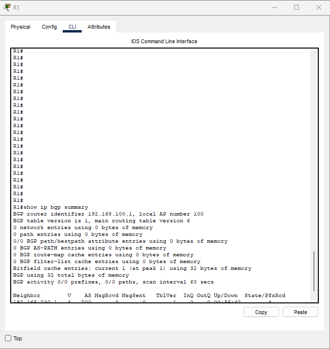

**R2 – `show ip bgp summary`**  
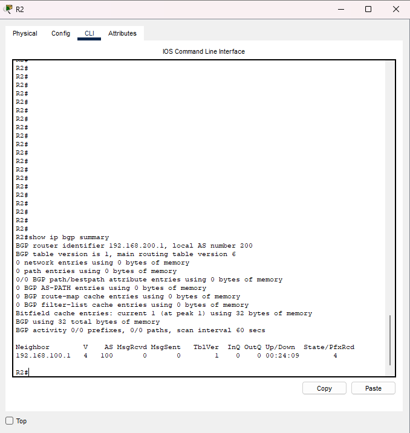

---

### Routing Table Verification

**R1 – `show ip route bgp`**  
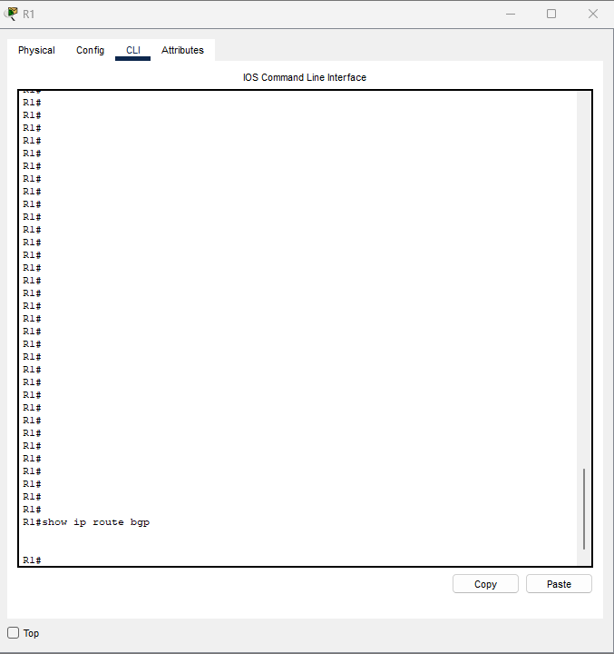

**R2 – `show ip route bgp`**  
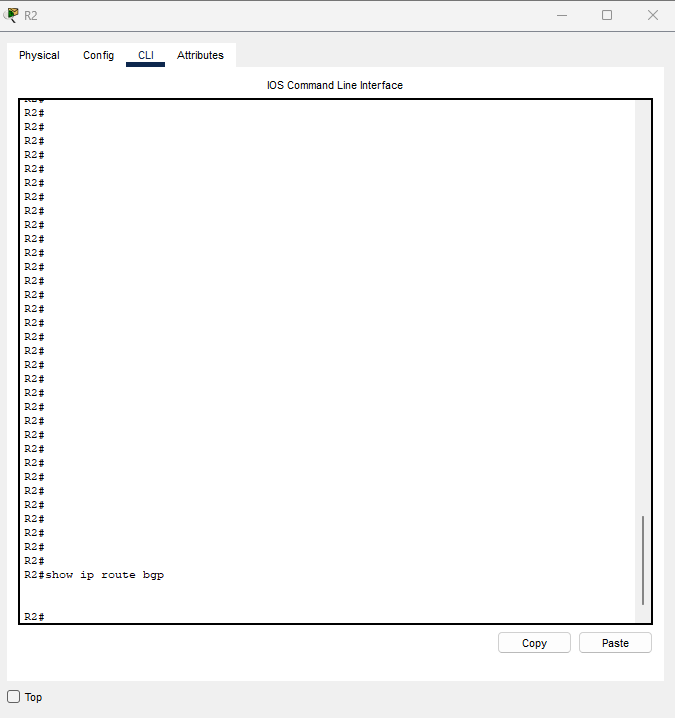

---

### Protocol Verification

**R1 – `show ip protocols`**  
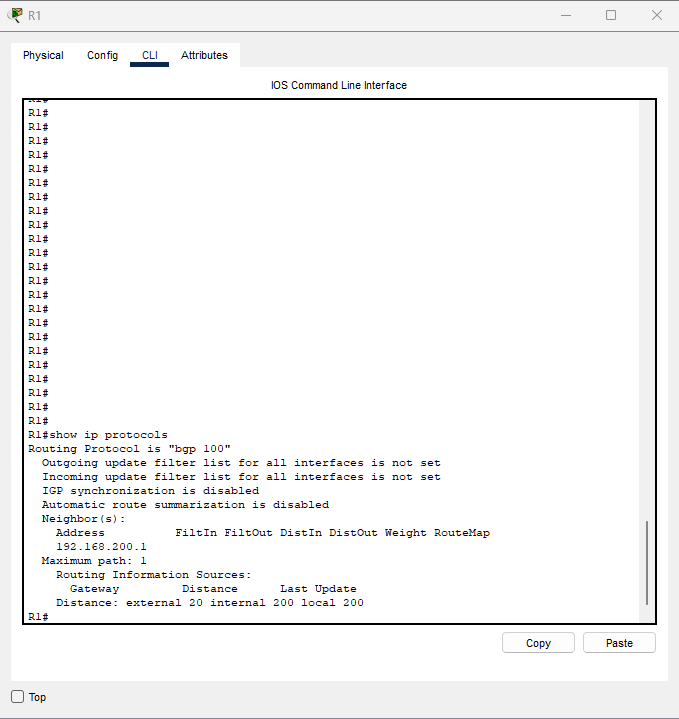

**R2 – `show ip protocols`**  
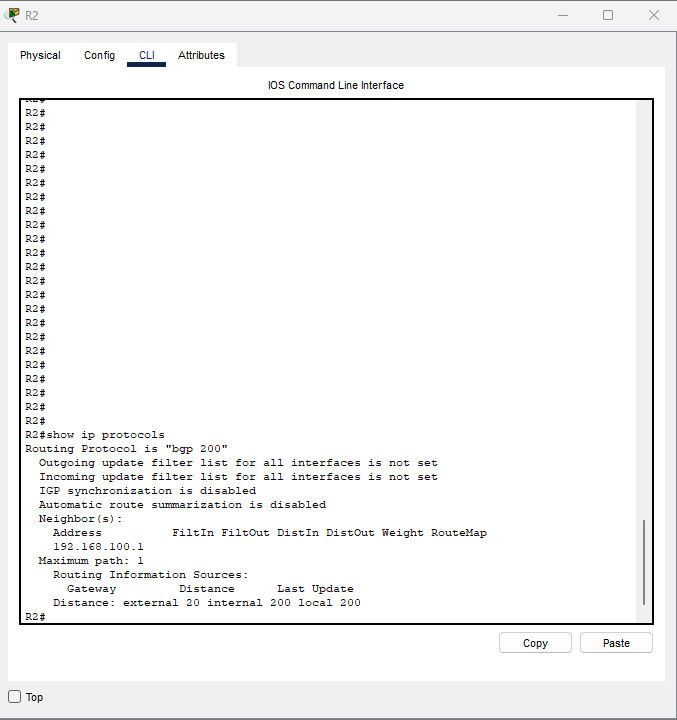

---

## ⚠️ Packet Tracer Limitations Observed

The following valid IOS commands produced errors due to **Packet Tracer limitations**, not incorrect syntax:

- `neighbor x.x.x.x update-source loopback`
- `neighbor x.x.x.x ebgp-multihop`
- `neighbor x.x.x.x timers`
- `neighbor x.x.x.x password`
- `ping x.x.x.x source loopback`

These commands are supported on **real Cisco IOS** and **enterprise routers**, but are **not fully implemented in Packet Tracer**.

---

## ✅ Lab Status
✔ eBGP session established  
✔ Networks advertised successfully  
✔ Verification commands executed  
✔ Limitations documented transparently  

---

## 📘 Key Takeaways
- Packet Tracer provides partial BGP functionality
- Not all IOS BGP features are supported
- Real-world BGP configurations require full IOS or emulation platforms
- Documenting platform limitations is essential for professional proof-of-work

---

**Author:** Ronique Young  
**Track:** CAINO – Phase 1  
**Purpose:** Proof of Work / Skill Validation

