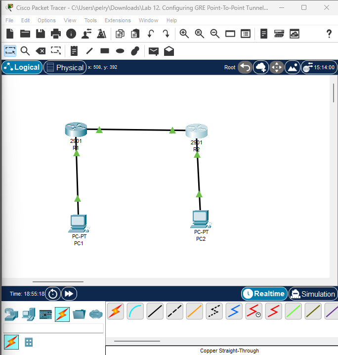
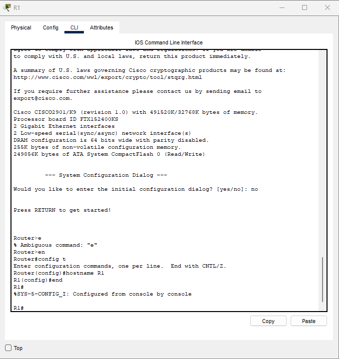
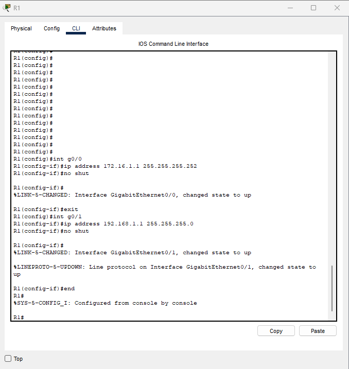
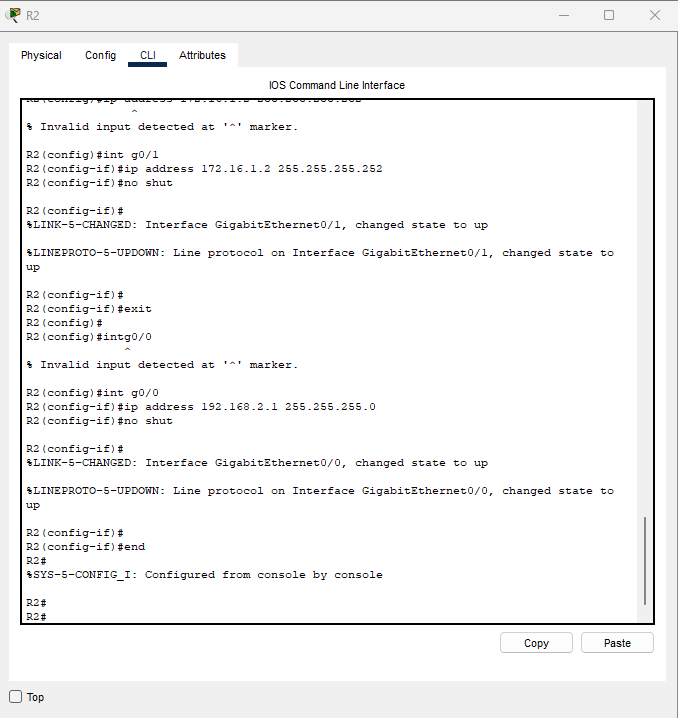
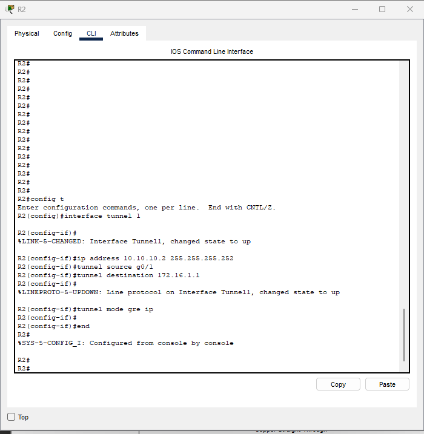
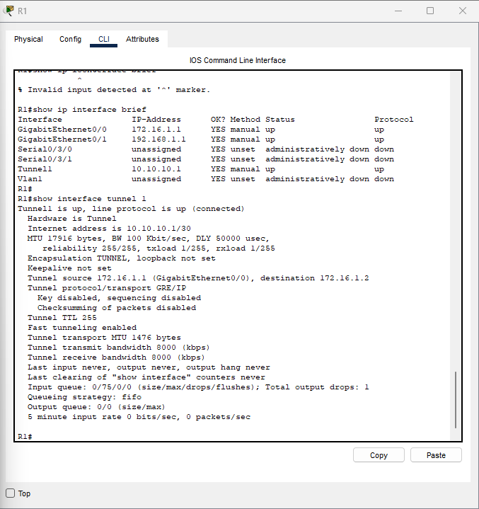
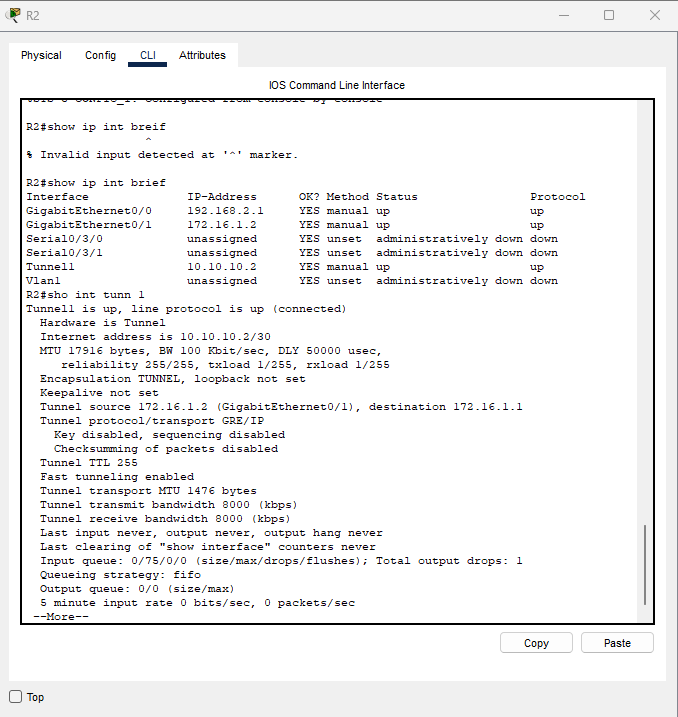
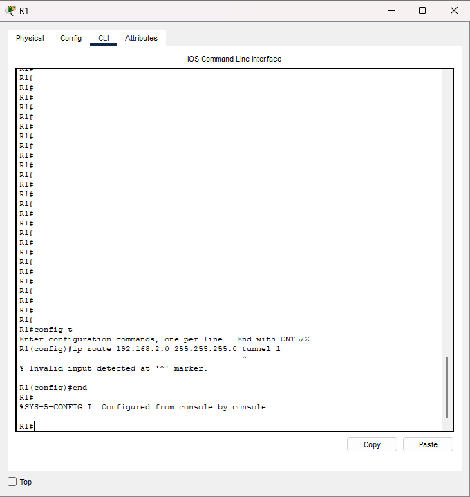
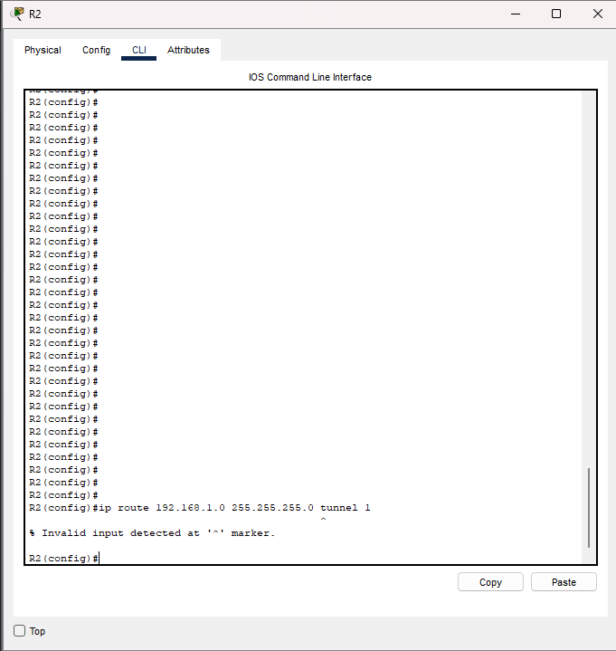

````markdown
# Lab 12 – Configuring GRE Point-to-Point Tunnel (Cisco IOS)

## Lab Objective
Configure and verify a **GRE (Generic Routing Encapsulation) point-to-point tunnel** between two Cisco routers to enable communication between two separate LANs across an IP network.

---

## Lab Purpose
This lab demonstrates real-world GRE tunnel configuration and verification using Cisco IOS syntax.  
Any errors encountered during this lab are **due to Cisco Packet Tracer limitations** and **do not indicate invalid IOS commands**.

---

## Network Topology



---

## Addressing Scheme

| Device | Interface | IP Address |
|------|---------|-----------|
| R1 | G0/0 | 172.16.1.1 /30 |
| R1 | G0/1 | 192.168.1.1 /24 |
| R1 | Tunnel1 | 10.10.10.1 /30 |
| R2 | G0/1 | 172.16.1.2 /30 |
| R2 | G0/0 | 192.168.2.1 /24 |
| R2 | Tunnel1 | 10.10.10.2 /30 |

---

## Initial Device Setup

```bash
enable
configure terminal
hostname R1
end
````



---

## Physical Interface Configuration

### R1 Interface Configuration

```bash
interface g0/0
 ip address 172.16.1.1 255.255.255.252
 no shutdown

interface g0/1
 ip address 192.168.1.1 255.255.255.0
 no shutdown
```



---

### R2 Interface Configuration

```bash
interface g0/1
 ip address 172.16.1.2 255.255.255.252
 no shutdown

interface g0/0
 ip address 192.168.2.1 255.255.255.0
 no shutdown
```



---

## GRE Tunnel Configuration

### R1 GRE Tunnel Configuration

```bash
interface tunnel 1
 ip address 10.10.10.1 255.255.255.252
 tunnel source g0/0
 tunnel destination 172.16.1.2
 tunnel mode gre ip
```


---

### R2 GRE Tunnel Configuration

```bash
interface tunnel 1
 ip address 10.10.10.2 255.255.255.252
 tunnel source g0/1
 tunnel destination 172.16.1.1
 tunnel mode gre ip
```



---

## Tunnel Verification

### R1 Tunnel Verification

```bash
show interface tunnel 1
```



---

### R2 Tunnel Verification

```bash
show interface tunnel 1
```



---

## Static Routing Over GRE

### Intended Static Routes (Valid Cisco IOS)

```bash
ip route 192.168.2.0 255.255.255.0 tunnel 1
ip route 192.168.1.0 255.255.255.0 tunnel 1
```

---

### Cisco Packet Tracer Limitation

Cisco Packet Tracer does **not fully support interface-based static routing using GRE tunnel interfaces**.
As a result, valid IOS commands may return syntax errors within Packet Tracer.





---

## Platform Limitations Documented

| Feature                                 | Status                         |
| --------------------------------------- | ------------------------------ |
| GRE tunnel configuration                | Supported                      |
| Tunnel interface verification           | Supported                      |
| Interface-based static routing over GRE | Not supported in Packet Tracer |

---

## Verification Commands Used

```bash
show ip interface brief
show interface tunnel 1
show running-config
```

---

## Key Takeaways

* GRE tunnels provide logical point-to-point connectivity over IP networks
* Tunnel interfaces behave like virtual WAN links
* Static routing over GRE is valid in real Cisco IOS environments
* Simulator limitations must be documented accurately for proof-of-work credibility

---

## Proof of Work Statement

This lab is part of my **hands-on networking proof-of-work**, focused on real IOS behavior, transparent documentation, and clear differentiation between platform limitations and protocol functionality.

---

**Author:** Ronique Young
**Track:** CAINO – Chief AI Network Engineer Officer
**Platform:** Cisco Packet Tracer

```
```

