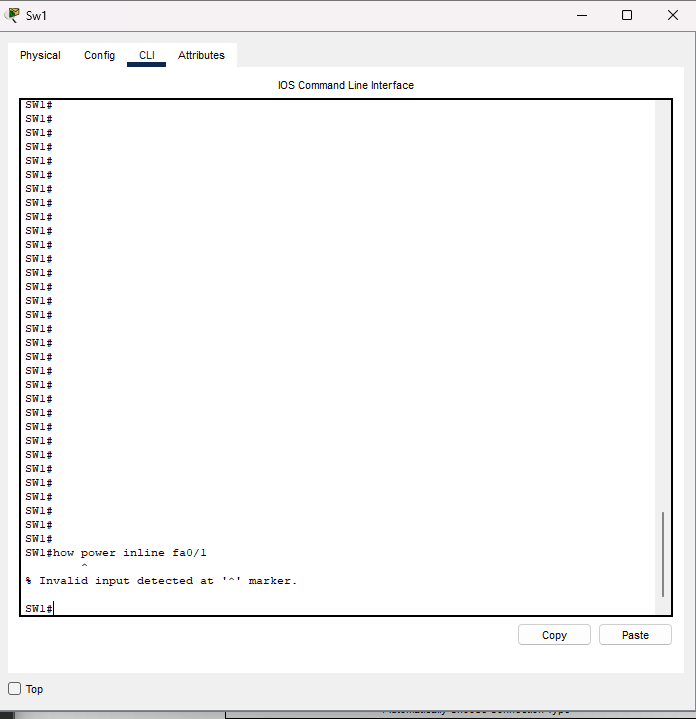
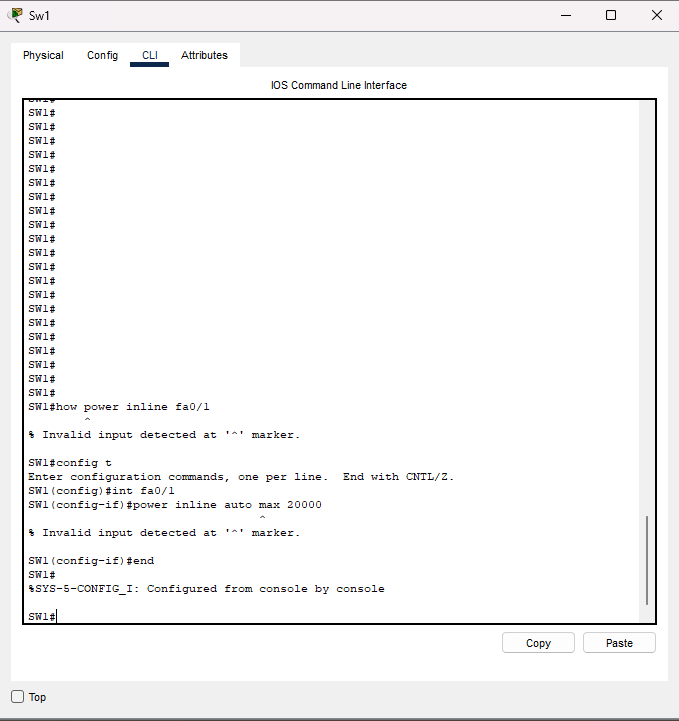

# Lab 12 – Configuring and Verifying Power over Ethernet (PoE) on a Cisco Switch

## Lab Objective
The objective of this lab is to **configure, verify, and understand Power over Ethernet (PoE)** functionality on a Cisco Catalyst switch. This lab demonstrates how a switch detects, negotiates, and supplies power to a PoE-capable device (Cisco IP Phone 7960) and how to verify PoE status using IOS commands.

## Lab Purpose
Power over Ethernet is a critical enterprise networking feature that allows devices such as IP phones, wireless access points, and cameras to receive power directly from the switch. As a Cisco engineer and CCNA candidate, you must understand:
- How PoE operates at Layer 2
- How to verify PoE delivery
- How Packet Tracer simulates PoE behavior and its limitations

---

## Network Topology
The topology consists of a single switch connected to a Cisco IP Phone using a FastEthernet interface.

---

## Devices Used
- Cisco Catalyst 3560-24PS (PoE-capable switch)
- Cisco IP Phone 7960
- Copper straight-through Ethernet cable

---

## Initial Switch Configuration
The switch was accessed through the CLI and assigned a hostname.

---

## PoE Detection and Power Grant (System Messages)
When the IP Phone was connected, the switch automatically detected a PoE-capable powered device (PD) and granted power. This occurs through IEEE power negotiation.

---

## Verifying PoE Status (Global)
The following command verifies overall PoE availability and usage on the switch:

show power inline

This output confirms:
- Total power available
- Power currently used
- Power remaining
- Which interfaces are delivering power

---

## Verifying PoE on a Specific Interface
To verify PoE status on a particular interface, the following command was attempted:

show power inline fa0/1

### Packet Tracer Limitation
In Packet Tracer, this command is **not supported** and returns an invalid input error.

### Real IOS Behavior (Important)
On a real Cisco Catalyst switch running full IOS, this command **is valid** and would display detailed PoE information for the specified interface, including:
- Power state
- Power consumption
- Device class
- Detection status

The error shown here is a **Packet Tracer limitation**, not an invalid or incorrect command.

---

## Attempting Manual PoE Configuration
The following interface-level configuration was attempted:

interface fa0/1
power inline auto max 20000

### Packet Tracer Limitation
Packet Tracer does **not support manual PoE power configuration** on interfaces. The command results in an invalid input error.

### Real IOS Behavior (Important)
On real hardware, this command allows the administrator to:
- Enable PoE negotiation
- Define a maximum power allocation (in milliwatts)
- Protect the switch from over-powering a device

Again, the failure here is due to **Packet Tracer feature limitations**, not incorrect syntax.

---

## Confirming Power Delivery to the IP Phone
Despite the above limitations, PoE is still successfully delivered automatically by the switch.

The verification output confirms:
- Interface Fa0/1 is operational
- Power is being supplied
- The IP Phone is detected and powered on

---

## Key Observations
- PoE negotiation occurs automatically when a powered device is detected
- The switch successfully powers the Cisco IP Phone
- Packet Tracer supports **PoE detection and monitoring**
- Packet Tracer does **not support advanced PoE interface configuration**
- Some valid IOS commands are rejected due to simulator limitations

---

## Lab Takeaways
- PoE is a Layer 2 feature essential for modern enterprise networks
- Verification commands are critical for troubleshooting powered devices
- Packet Tracer should be used as a **learning simulator**, not a full IOS replacement
- Understanding simulator limitations is part of real-world engineering judgment

---

## Platform Limitations (Packet Tracer)
The following commands are valid on real Cisco IOS devices but are **not supported in Packet Tracer**:
- `show power inline fa0/1`
- `power inline auto max <value>`

These limitations do **not** indicate invalid configuration or incorrect syntax.

---

## Status
✔ PoE successfully detected  
✔ Power delivered to IP Phone  
✔ Verification completed  
✔ Limitations documented  

---

