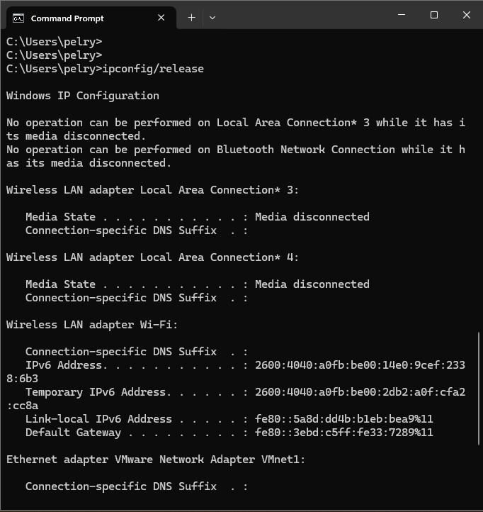
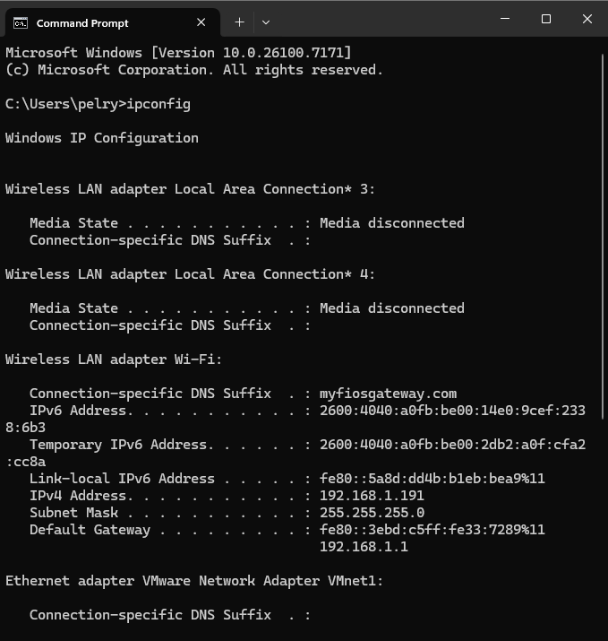
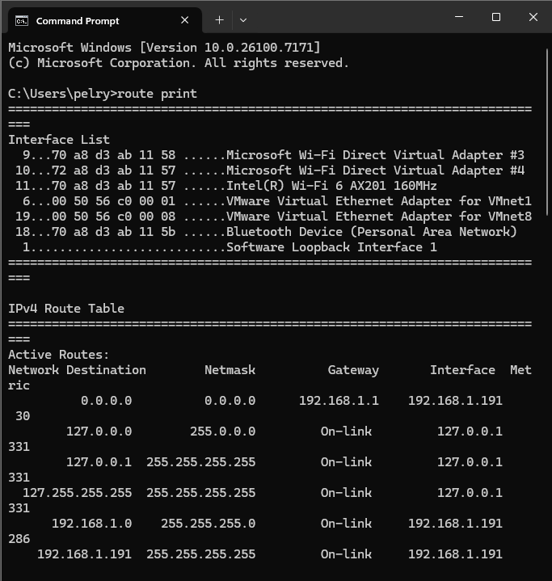
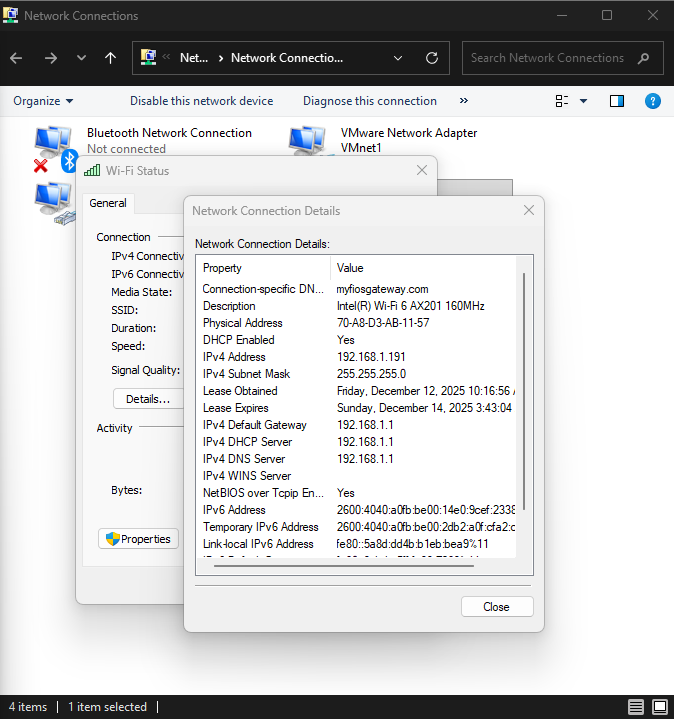
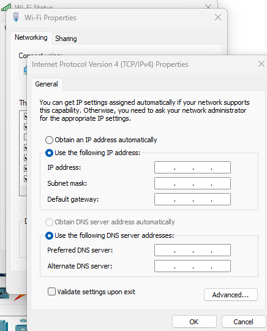

# Lab 14 – Verify IP Parameters for Windows OS (GUI and CLI)

## Lab Objective
Verify **IP configuration parameters on a Windows operating system** using both **CLI** and **GUI** tools. This includes IPv4/IPv6 addressing, subnet mask, default gateway, DNS settings, and routing information.

## Lab Purpose
Verifying end-host IP configuration is a **first-step troubleshooting requirement** before analyzing routers or switches. This skill is fundamental for **CCNA-level networking** and real-world operations.

---

## Network Topology / Lab Environment

---

## CLI Verification Evidence

### IP Release

### IP Configuration Verification

### Routing Table Verification

### Detailed Adapter Configuration

---

## GUI Verification Evidence

### Network Connection Details

### TCP/IPv4 Properties Configuration

---

## Complete Evidence Set (ALL Screenshots)

---

## Verification Summary
- IPv4 address, subnet mask, and gateway verified
- DNS configuration confirmed
- IPv6 global and link-local addresses observed
- Routing table validated using `route print`
- GUI and CLI outputs matched

---

## Key Takeaways
- Always verify the **host first**
- `ipconfig` validates addressing
- `route print` confirms traffic flow logic
- GUI tools provide confirmation and configuration control
- Virtual adapters (VMware) can introduce additional routes—identify the active interface

---

## Platform Notes
All commands used are **fully supported on Windows OS**:
- `ipconfig`
- `route print`

---

## Status
✅ Lab completed  
✅ CLI + GUI verified  
✅ ALL screenshots embedded  

