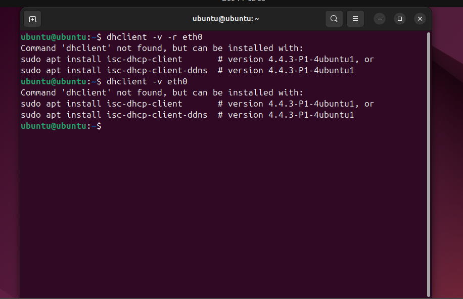
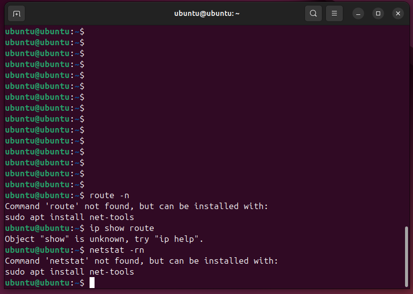
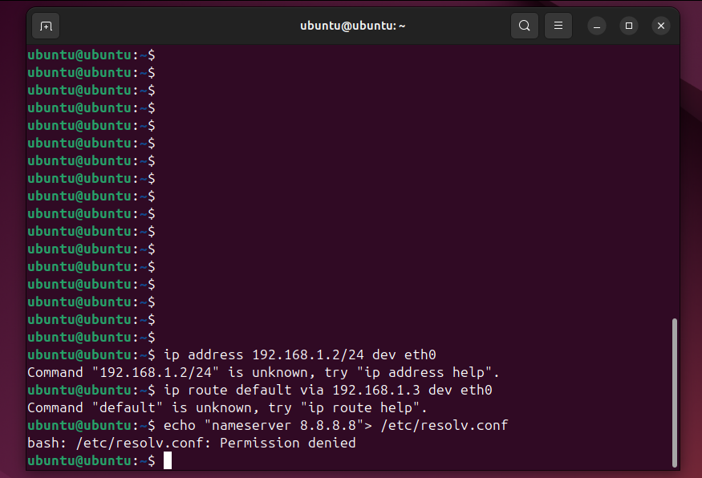
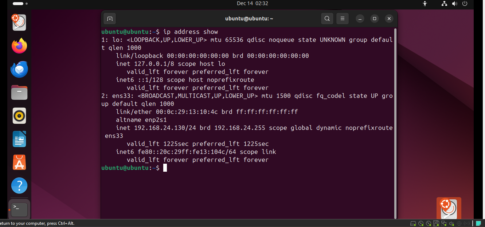

# Lab – Verify IP Parameters on Ubuntu (GUI + CLI) | VMware Workstation (Ubuntu Desktop 24.04)

## Lab Objective
Verify and configure IPv4 settings on **Ubuntu Desktop 24.04** running in **VMware Workstation**, using:
- **GUI (NetworkManager settings)**
- **CLI (ip / nmcli / resolvectl)**

You will confirm:
- Interface name
- IPv4 address + subnet
- Default gateway
- DNS resolver(s)

---

## Lab Environment
- Host: Windows (VMware Workstation)
- Guest: Ubuntu Desktop 24.04
- Primary NIC (guest): **ens33** (common in VMware)
- Addressing example used in this lab:
  - Static IP: `192.168.1.2`
  - Mask: `255.255.255.224` (=/27)
  - Gateway: `192.168.1.3`
  - DNS: `8.8.8.8`

---

## Proof Screenshots (Required)







---

## Step 1 — Identify the Active Interface (CLI)
On modern Ubuntu + VMware, your interface is typically **ens33** (not `eth0`).

### Commands
```bash
ip link
ip a
```
What to look for

An interface with state UP (example: ens33)

An IPv4 address like 192.168.x.x/24 or your configured subnet

Step 2 — Verify IP, Gateway, and DNS (CLI)
2A) Verify IP Address

```bash
ip a show ens33
```

2B) Verify Default Route (Gateway)

Correct command:
```bash 
ip route
```

Note: ip show route is incorrect syntax (it should be ip route).

2C) Verify DNS
On Ubuntu 24.04, DNS is commonly managed by systemd-resolved.

```bash
resolvectl status
```
Optional:
```bash 
cat /etc/resolv.conf
```

Note: Directly writing to /etc/resolv.conf often fails (or gets overwritten) because it is managed automatically (symlinked/controlled by system services).

Step 3 — Configure Static IPv4 in the GUI (Recommended for Desktop)

Open Settings

Go to Network

Select the wired interface (ens33)

Open IPv4

Set IPv4 Method to Manual

Enter:

Address: 192.168.1.2

Netmask: 255.255.255.224 (or use CIDR /27 when applicable)

Gateway: 192.168.1.3

DNS: 8.8.8.8

Click Apply

Toggle the connection OFF then ON (or disconnect/reconnect)

Step 4 — Configure IPv4 via CLI (Two Correct Options)
Option A (Best) — Use NetworkManager (nmcli) on Desktop Ubuntu

Find the connection name:
```bash
nmcli con show
```
Set static IP, gateway, and DNS (replace <CON_NAME> with your connection name):
```bash
sudo nmcli con mod "<CON_NAME>" ipv4.addresses 192.168.1.2/27
sudo nmcli con mod "<CON_NAME>" ipv4.gateway 192.168.1.3
sudo nmcli con mod "<CON_NAME>" ipv4.dns "8.8.8.8"
sudo nmcli con mod "<CON_NAME>" ipv4.method manual
sudo nmcli con up "<CON_NAME>"
```

Option B (Temporary) — Use ip commands (resets after reboot)

Useful for quick testing, but not persistent.
```bash
sudo ip addr add 192.168.1.2/27 dev ens33
sudo ip route add default via 192.168.1.3 dev ens33
```

DNS (temporary approach depends on your resolver setup). For Desktop Ubuntu, prefer the nmcli method above.

Step 5 — Verification Tests
5A) Confirm IP + Route
```bash
ip a show ens33
ip route
```

5B) Confirm DNS
```bash
resolvectl status
```

5C) Connectivity Tests
```bash
ping -c 4 192.168.1.3
ping -c 4 8.8.8.8
ping -c 4 google.com
```

Expected outcomes:

Gateway ping succeeds (L3 local reachability)

8.8.8.8 ping succeeds (internet routing)

google.com ping succeeds (DNS resolution + internet)

Troubleshooting Notes (What Went Wrong + Fix)
Issue 1 — dhclient not found

Observed:

dhclient -v eth0 returned: Command 'dhclient' not found

Why:
Ubuntu 24.04 may not include dhclient by default.
Fix options:
Prefer NetworkManager tools (Desktop):
nmcli dev show
reconnect the interface via GUI
Or install dhclient if your lab specifically requires it:
```bash
sudo apt update
sudo apt install isc-dhcp-client -y
```
Also note:
Your interface is likely ens33, not eth0.
Issue 2 — route / netstat not found
Observed:
route -n and netstat -rn returned: Command not found
Why:
Those commands are from the legacy net-tools package (not installed by default).

Fix:
Use modern replacements:
ip route (instead of route -n)
ss (instead of netstat)
Or install net-tools if required:
```bash
sudo apt update
sudo apt install net-tools -y
```
Issue 3 — Incorrect ip syntax used
Observed:
ip show route failed
ip address 192.168.1.2/24 dev eth0 failed

Correct commands:
```bash
ip route
sudo ip addr add 192.168.1.2/27 dev ens33
sudo ip route add default via 192.168.1.3 dev ens33
```

Issue 4 — Permission denied editing /etc/resolv.conf
Observed:
echo "nameserver 8.8.8.8" > /etc/resolv.conf returned: Permission denied

Why:
Needs sudo and /etc/resolv.conf is usually managed by system services.
Correct fix (Desktop Ubuntu):
Set DNS via GUI or nmcli (recommended).
Example:

```bash
sudo nmcli con mod "<CON_NAME>" ipv4.dns "8.8.8.8"
sudo nmcli con up "<CON_NAME>"
```
Lab Takeaways
On Ubuntu 24.04 Desktop, prefer GUI / NetworkManager (nmcli) over legacy tools.
VMware guests typically use interface names like ens33, not eth0.
Modern networking verification uses:
ip a, ip route
resolvectl status
dhclient, route, and netstat may be missing by default and must be installed if required.

Files & Folder Structure
lab-verify-ip-parameters-ubuntu/
├── README.md
└── screenshots/
    ├── ubuntu-vmware-topology.png
    ├── ubuntu-dhclient-config.png
    ├── ubuntu-show-commands.png
    ├── ubuntu-gateway-dns.png
    ├── ubuntu-static-ip-config .png
    └── vmware-ip-address-show.png


